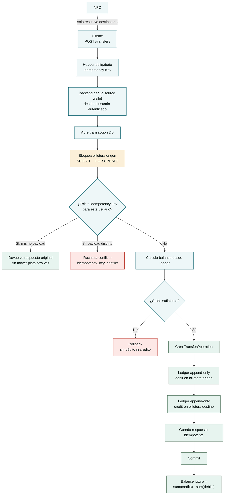

# FlowPay

FlowPay es una billetera digital para facilitar las transferencias de dinero p2p.

 Elegí construir bien una transferencia presencial asistida por NFC, montada sobre un núcleo financiero que no trata a NFC como un atajo peligroso. NFC solo ayuda a reducir fricción a la hora de enviar dinero en persona. La plata siempre se mueve por el mismo flujo transaccional, con confirmación explícita, idempotencia, bloqueo de billetera origen y ledger auditable.

## Qué Construí

El sistema permite:

- registrar un usuario;
- crear automáticamente su billetera;
- entregar un bono inicial de COP 50,000 como una transacción auditable;
- iniciar sesión;
- consultar saldo derivado;
- ver historial de transacciones con contraparte;
- hacer recargas de saldo;
- transferir a otro usuario manualmente o asistido por NFC;

La oportunidad que vi fue que NFC no tenía que ser "pago contactless". Para este reto era más valioso usarlo como reducción de fricción en un escenario real: alguien en una tienda, universidad, evento o grupo de amigos quiere pagarle a otra persona que tiene al lado. Solo juntando sus dispositivos fisicamente obtienes los datos de a quién le vas a enviar el dinereo.

## La Parte Que Más Me Importó

Puse empeño en evitar ciertos errores:

- perder plata por una transferencia parcial;
- duplicar una transferencia por doble tap o retry del celular;
- calcular saldos no auditables;
- dejar que NFC escriba movimientos financieros por fuera del flujo seguro;

Por eso el backend usa un ledger append-only. El saldo no se guarda como un campo mutable de la billetera; se deriva de transacciones:

```text
balance = sum(credit) - sum(debit)
```

Una transferencia completada crea una operación y exactamente dos movimientos:

- un `debit` en la billetera origen;
- un `credit` en la billetera destino.

Ambos comparten `operation_id`, monto, moneda y origen (`manual_transfer` o `nfc_transfer`). Si algo falla antes del commit, no debe quedar medio movimiento registrado.

## Cómo Protejo El Dinero

Las decisiones principales fueron:

- **PostgreSQL como fuente de verdad.** Necesitaba transacciones ACID, constraints y row-level locking. No quería validar un flujo de dinero sobre SQLite o memoria.
- **Montos enteros en COP.** No uso floats para dinero.
- **Una transacción de base de datos por transferencia.** Operación, débito, crédito e idempotencia se escriben dentro del mismo límite transaccional.
- **`SELECT ... FOR UPDATE` sobre la billetera origen.** Antes de leer saldo y escribir movimientos, bloqueo la billetera que envía. Eso evita doble gasto concurrente desde la misma cuenta.
- **Idempotency-Key obligatoria en `POST /transfers`.** El mismo usuario con la misma key y el mismo payload recibe la misma respuesta; la misma key con otro payload se rechaza.
- **NFC no tiene permisos financieros.** El módulo NFC vive en mobile, resuelve un `destination_username` y llama el mismo endpoint de transferencias.
- **Errores estables.** Las respuestas usan `{ "error": { "code", "message" } }` y no filtran secretos ni detalles internos.



## Arquitectura

Elegí un monolito modular con límites hexagonales por módulo:

```text
backend/src/flowpay/
  auth/
  users/
  wallets/
  ledger/
  transfers/
```

Cada módulo separa, cuando aplica:

```text
domain/
application/
ports/
adapters/
```

En la práctica, la capa `application` contiene hoy la mayoría de reglas e invariantes, y `domain/` está preparada pero poco usada. Lo dejo escrito porque es una deuda real: para una segunda iteración movería reglas puras de `ledger` y `transfers` a modelos de dominio más ricos. Aun así, el código ya mantiene lo importante para esta entrega: routers delgados, repositorios como adaptadores, servicios de aplicación sin FastAPI/SQLAlchemy, y pruebas de límites arquitectónicos.

En mobile usé módulos por feature:

```text
mobile/src/modules/
  auth/
  wallet/
  transfers/
  nfc/
```

NFC está aislado en `mobile/src/modules/nfc/`. El backend no tiene un módulo NFC porque NFC no es un subsistema financiero; es un canal de inicio.

## Stack Y Por Qué

**Backend:** FastAPI + Python 3.12.  
Lo elegí porque permite iterar rápido sin imponer una arquitectura pesada. FastAPI queda en los bordes; las reglas viven en servicios de aplicación.

**Base de datos:** PostgreSQL 16.  
Es la decisión más importante del stack. Necesitaba locks, transacciones reales, constraints y semántica cercana a producción para probar dinero.

**Persistencia:** SQLAlchemy 2.x sync + psycopg v3.  
Preferí sync para que la secuencia transaccional del core financiero sea directa y fácil de auditar. En esta escala, claridad gana sobre optimización async.

**Migraciones:** Alembic.  
Quería que el modelo de datos evolucionara con historial explícito.

**Mobile:** React Native + Expo development builds.  
Expo Go no sirve para NFC porque no incluye módulos nativos arbitrarios. Por eso el proyecto Android está comprometido.

**NFC:** `react-native-nfc-manager`.  
Lo usé solo como adaptador mobile. No le doy autoridad para mover plata.

**Estado cliente:** React Query + storage seguro para token.  
El cliente cachea para UX, pero refresca estado financiero desde backend.

## Endpoints Principales

- `POST /auth/register`
- `POST /auth/login`
- `GET /auth/me`
- `GET /wallet`
- `GET /wallet/transactions`
- `POST /wallet/topup`
- `POST /transfers`
- `GET /transfers/{transfer_id}`
- `GET /health`

`POST /transfers` requiere:

```text
Authorization: Bearer <token>
Idempotency-Key: <client-generated-key>
```

Y acepta destino por `destination_wallet_id` o por `destination_username`, pero no ambos.

## Cómo Correrlo

Requisitos:

- Python 3.12;
- uv;
- Docker;
- Node.js;
- npm;
- Android Studio o dispositivo Android para NFC real.

Backend:

```bash
cd backend
cp .env.example .env
cd ..
docker compose up -d db db_test
cd backend
uv sync
uv run alembic upgrade head
uv run uvicorn flowpay.main:app --reload
```

API:

```text
http://localhost:8000
http://localhost:8000/docs
```

Mobile:

```bash
cd mobile
cp .env.example .env
npm install
npm run android
```

En un dispositivo físico, `EXPO_PUBLIC_API_URL` debe apuntar a la IP local de la máquina, no a `localhost`.

## Pruebas

Backend:

```bash
cd backend
uv run pytest
```

Mobile:

```bash
cd mobile
npm test
```

La suite cubre auth, registro, wallet, ledger, transferencias, idempotencia, errores, límites arquitectónicos, clientes mobile y parsing/orquestación NFC sin depender de hardware real.

La validación NFC completa sigue necesitando dispositivo Android compatible. Esa parte no la escondo: los tests automatizados prueban payloads y flujo de aplicación, pero el comportamiento físico de NFC no se puede garantizar solo con Jest.

## Qué Dejé Fuera

Dejé fuera:

- dinero real y proveedores externos;
- KYC, bancos, PSE, tarjetas o conciliación;
- multi-moneda;
- reversos y disputas;
- refresh tokens y revocación de sesiones;
- límites antifraude avanzados;
- notificaciones push;
- iOS NFC;
- offline mode;
- un panel administrativo;
- observabilidad productiva completa.

La razón fue foco. Preferí que una transferencia interna sea defendible antes que simular un producto financiero completo con bases débiles.

## Qué Haría Distinto Con Más Tiempo

Refinaría tres cosas:

- Extraería reglas puras de `ledger` y `transfers` a objetos de dominio más explícitos. Hoy la arquitectura lo permite, pero no está aprovechada del todo.
- Agregaría una prueba de concurrencia más agresiva para doble gasto, con varios workers pegándole a la misma billetera.
- Diseñaría reversos como transacciones compensatorias, no como edición de movimientos existentes.
- Endurecería la estrategia de autenticación. Hoy uso access tokens JWT firmados, con expiración y guardados en SecureStore en mobile. Para una versión más cercana a producción agregaría refresh tokens revocables, sesiones por dispositivo, rotación de tokens, `jti` para trazabilidad de tokens, validación de `issuer`/`audience`, y logout server-side real.

Después de eso trabajaría en rate limits, auditoría operacional, trazas, y una estrategia más fuerte para payloads NFC temporales.

## Qué No Sé

No sé si el flujo NFC propuesto será suficientemente confiable en todos los Android reales que usaría una beta. NFC en mobile tiene diferencias por modelo, fabricante, versión de Android y configuración.

React Native tampoco era una tecnología que manejara con la misma comodidad que React web. Sé React y esos fundamentos sí están aplicados: componentes, estado, hooks, efectos, separación por módulos y flujo de datos. Lo que acepto como zona de riesgo es lo específico de React Native: navegación mobile, diferencias de componentes nativos, permisos, secure storage, builds con Expo prebuild y la integración con NFC. Para esas partes trabajé más despacio, revisando documentación mientras construía y apoyándome en IA para contrastar patrones antes de decidir.

## Supuestos Que Hice

Asumí que:

- la primera versión maneja solo COP;
- las transferencias son internas entre usuarios FlowPay;
- el bono inicial es dinero de prueba para activar el flujo;
- top-up es simulado, no una carga real desde un banco;
- Android es suficiente para validar NFC;
- NFC se usa entre personas que pueden verificar visualmente al destinatario;
- el backend es la única autoridad para balances y movimientos;
- una base PostgreSQL compartida es aceptable mientras los módulos mantengan propiedad de datos.

Hice esos supuestos porque el reto pide una cosa bien hecha, no una fintech completa.

## Cómo Usé IA

Usé IA como researcher, apoyo de planning, implementador de código y revisor de cambios. Por lo general trabajé con una estrategia de **plan then act**: primero investigar y bajar la feature a un plan revisable, después ejecutar cambios acotados, y al final revisar si el resultado respetaba las decisiones del proyecto.

También incorporé skills base en `.agents/` para empujar el proyecto por un camino consistente. Cada skill fue intencional: backend FastAPI, mobile React Native, seguridad/ledger, testing y arquitectura. No quería que cada conversación con IA inventara una arquitectura nueva; quería que los agentes trabajaran con los mismos límites del proyecto.

La usé para:

- investigar documentación y prior art antes de cerrar decisiones;
- planear features en pasos revisables antes de implementar;
- comparar alternativas de arquitectura y stack;
- convertir decisiones en ADRs;
- revisar riesgos de dinero, idempotencia y ledger;
- implementar código cuando el plan ya estaba claro;
- acelerar scaffolding de módulos;
- entender diferencias puntuales entre React web y React Native mientras implementaba mobile;
- escribir pruebas alrededor de invariantes;
- detectar acoplamientos raros entre capas;
- revisar el README y obligarme a explicar tradeoffs.

Para trabajo ambiguo o de alto riesgo usé modelos con más razonamiento, como Opus 4.6, especialmente para planear features, revisar arquitectura y discutir decisiones de seguridad. Para ejecutar planes ya revisados y tareas más mecánicas usé modelos más rápidos, como Haiku. Esa separación me ayudó a no gastar razonamiento caro en tareas simples, pero tampoco dejar decisiones importantes en manos de un modelo usado como autocompletado.

Yo tomé las decisiones de producto y de corte: elegir NFC como feature principal, mantenerlo fuera del backend financiero, usar ledger append-only, no usar floats, exigir idempotencia, dejar fuera iOS y no fingir soporte bancario real.

## Qué Aprendí

Me llevo varios aprendizajes.

Primero, aprendí a distribuir mejor el tiempo disponible entre planeación y desarrollo. El reto no era construir todo; era decidir qué podía quedar sólido en el tiempo disponible y qué era mejor dejar explícitamente fuera.

Segundo, investigué un poco sobre la relación entre aprendizaje guiado por IA y codificación asistida. Me quedó claro que la IA puede acelerar mucho, pero si uno no controla el proceso puede generar deuda cognitiva: código que "funciona", pero que uno no entiende lo suficiente para defender, mantener o corregir. Por eso intenté trabajar con planes, revisiones y explicaciones antes de aceptar cambios importantes.

## Estructura Del Repo

```text
backend/      FastAPI, SQLAlchemy, Alembic, tests
mobile/       React Native, Expo dev build, NFC, tests
docs/         ADRs, specs, investigación y planes
docker-compose.yml
```

Los documentos clave están en:

- `docs/adr/0001-backend-architecture.md`
- `docs/adr/0003-stack-selection.md`
- `docs/adr/0004-money-and-ledger-model.md`
- `docs/product/02-feature-selection.md`
- `docs/specs/04-api-contract.md`
