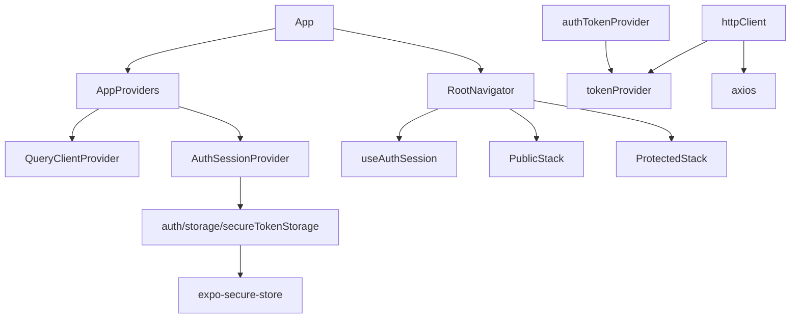

# FlowPay Mobile — Initial Setup

## Overview

React Native project scaffolding with Expo Prebuild in `mobile/`.

This plan builds a minimal mobile infrastructure MVP, but not a temporary architecture. The app is ready to grow by modules without redoing the foundation: typed navigation, auth session state, secure storage for JWT, HTTP client decoupled from auth storage, TanStack Query for server state, and boundaries compatible with React Native and ADRs.

No functional product screens are built in this plan. Only the base structure and necessary placeholders are created to validate that the app runs on Android with a development build.

---

## Architectural Intent

### Principle

A minimal MVP means **less functional scope**, not worse boundaries.

The mobile architecture does not use hexagonal/clean architecture as dogma. The default is an idiomatic feature-based structure in React Native. More formal layers are only added when they protect a real boundary: auth storage, API calls, NFC, transfer confirmation, or financial server state.

This setup avoids:

- coupling HTTP directly to secure storage;
- placing providers, hooks, storage adapters, API clients, and types in the same module root;
- leaving navigation untyped;
- creating speculative abstractions that do not protect a real boundary;
- making client state the financial authority.

### Base boundaries

```text
mobile/src/
  app/
    AppProviders.tsx
    navigation/
      RootNavigator.tsx
      types.ts
  modules/
    auth/
      hooks/
        useAuthSession.ts
      providers/
        AuthSessionProvider.tsx
      storage/
        authTokenProvider.ts
        secureTokenStorage.ts
      types.ts
    wallet/
    transfers/
    nfc/
  shared/
    api/
      httpClient.ts
      tokenProvider.ts
    ui/
```

Rules:

- `screens/` renders screens.
- `components/` contains local UI of the module.
- `hooks/` exposes reusable module behavior for screens.
- `api/` contains HTTP calls of the module.
- `storage/` encapsulates local storage or secure storage of the module.
- `adapters/` encapsulates native or external integrations like NFC.
- `types.ts` contains simple local types of the module.
- `shared/api` knows how to do HTTP, but doesn't know where the token lives.
- `auth/storage` registers the token provider used by HTTP.
- If a module grows a lot, it can introduce `application/`, `domain/`, or `infrastructure/`, but not as a mandatory initial structure.
- The client is never the authority for balances, transfer validity, source wallet, or ledger writes.

---

## Files Analyzed

### Architecture documentation

1. `docs/adr/0002-mobile-architecture.md`
   - React Native with Expo prebuild/development builds.
   - Feature modules structure.
   - NFC, auth storage, and server state boundaries.

2. `docs/adr/0003-stack-selection.md`
   - Expo prebuild/CNG.
   - `react-native-nfc-manager`.
   - `expo-secure-store`.
   - JWT in secure storage.

3. `docs/adr/0005-auth-strategy.md`
   - 1-hour JWT access token.
   - Token in secure storage.
   - Logout clears token.
   - Expired token requires login again.

4. `docs/specs/04-api-contract.md`
   - `Authorization: Bearer <token>` in protected endpoints.
   - Upcoming relevant endpoints: `POST /auth/login`, `POST /auth/register`, `GET /auth/me`.

5. `docs/research/06-mobile-architecture-and-tooling.md`
   - Confirms Expo prebuild as a fit for NFC.
   - Expo Go does not apply for validating NFC.

### Existing code

There is no mobile code yet. The `mobile/` directory is created from scratch.

---

## Current State

```text
flowpay/
  backend/        exists
  docs/           exists
  mobile/         does not exist
```

---

## Dependency Decisions

### Runtime

- `expo` with TypeScript template.
- `@react-navigation/native` and `@react-navigation/native-stack` for typed navigation.
- `@tanstack/react-query` for server state.
- `axios` for HTTP.
- `expo-secure-store` for access token.
- `react-native-nfc-manager` because NFC is already an accepted decision by ADR 0003 and requires a native build.

### Deliberate non-goals

- No Redux/Zustand/global store. Auth session is enough for initial coordination.
- No Expo Router in this setup. Explicit React Navigation fits better with guarded stacks and central types for this MVP.
- No shared UI kit before having two real uses.
- No backend-style folders (`presentation/application/domain/infrastructure`) in the initial scaffold.
- No full `401` handling yet, but an API client boundary is left that allows adding it without redoing storage or navigation.

---

## Proposed Changes

### Files to Modify

#### `mobile/app.json`

Replace the one generated by `create-expo-app` with:

```json
{
  "expo": {
    "name": "FlowPay",
    "slug": "flowpay",
    "version": "1.0.0",
    "orientation": "portrait",
    "icon": "./assets/icon.png",
    "userInterfaceStyle": "light",
    "splash": {
      "image": "./assets/splash.png",
      "resizeMode": "contain",
      "backgroundColor": "#ffffff"
    },
    "android": {
      "package": "com.flowpay.app",
      "permissions": ["android.permission.NFC"]
    },
    "plugins": ["expo-secure-store"]
  }
}
```

Rationale:

- Android-first, but without blocking future iOS at the architectural level.
- NFC permission enters from the first prebuild because NFC is part of the product accepted by ADR.
- `expo-secure-store` is configured as a native plugin.

#### `mobile/App.tsx`

```typescript
import { AppProviders } from './src/app/AppProviders'
import { RootNavigator } from './src/app/navigation/RootNavigator'

export default function App() {
  return (
    <AppProviders>
      <RootNavigator />
    </AppProviders>
  )
}
```

Rationale:

- `App.tsx` remains as a minimal composition root.
- Providers and navigation are not mixed in the generated file.

---

## Files to Create

### 1. `mobile/.env.example`

```bash
# Backend URL. On a physical device, use the Mac's local IP, not localhost.
# Example to find IP on macOS: ipconfig getifaddr en0
EXPO_PUBLIC_API_URL=http://YOUR_LOCAL_IP:8000
```

Do not version `.env`. The real file must exist only locally.

### 2. `mobile/src/shared/api/tokenProvider.ts`

```typescript
export type AccessTokenProvider = () => Promise<string | null>

let accessTokenProvider: AccessTokenProvider = async () => null

export function setAccessTokenProvider(provider: AccessTokenProvider) {
  accessTokenProvider = provider
}

export function getAccessToken() {
  return accessTokenProvider()
}
```

Rationale:

- `shared/api` does not import secure storage or the auth module.
- Auth can register how to obtain the token.
- If there are later refresh tokens, memory cache, global logout, or revocation, the change remains behind this contract.

### 3. `mobile/src/shared/api/httpClient.ts`

```typescript
import axios from 'axios'
import { getAccessToken } from './tokenProvider'

export const httpClient = axios.create({
  baseURL: process.env.EXPO_PUBLIC_API_URL ?? 'http://localhost:8000',
})

httpClient.interceptors.request.use(async (config) => {
  const token = await getAccessToken()

  if (token) {
    config.headers.Authorization = `Bearer ${token}`
  }

  return config
})
```

Rationale:

- HTTP only knows that a token provider exists.
- Feature modules use `httpClient`, not direct axios.
- Avoids repeating auth headers in screens or hooks.

### 4. `mobile/src/modules/auth/types.ts`

```typescript
export interface User {
  id: string
  username: string
}
```

Rationale:

- Stable local type for the session.
- Keeps the module simple and idiomatic for React Native.
- Does not depend on React, secure storage, or API client.

### 5. `mobile/src/modules/auth/storage/secureTokenStorage.ts`

```typescript
import * as SecureStore from 'expo-secure-store'

const ACCESS_TOKEN_KEY = 'fp_access_token'

export function saveAccessToken(token: string) {
  return SecureStore.setItemAsync(ACCESS_TOKEN_KEY, token)
}

export function getStoredAccessToken() {
  return SecureStore.getItemAsync(ACCESS_TOKEN_KEY)
}

export function clearStoredAccessToken() {
  return SecureStore.deleteItemAsync(ACCESS_TOKEN_KEY)
}
```

Rationale:

- Encapsulates the native library inside `auth/storage`.
- No screen or shared API imports `expo-secure-store`.

### 6. `mobile/src/modules/auth/storage/authTokenProvider.ts`

```typescript
import { setAccessTokenProvider } from '../../../shared/api/tokenProvider'
import { getStoredAccessToken } from './secureTokenStorage'

export function registerAuthTokenProvider() {
  setAccessTokenProvider(getStoredAccessToken)
}
```

Rationale:

- The auth module integrates its storage with the HTTP client without inverting the dependency.
- `shared/api` remains reusable and independent.

### 7. `mobile/src/modules/auth/providers/AuthSessionProvider.tsx`

```typescript
import React, { createContext, useCallback, useEffect, useMemo, useState } from 'react'
import type { User } from '../types'
import {
  clearStoredAccessToken,
  getStoredAccessToken,
  saveAccessToken,
} from '../storage/secureTokenStorage'

export interface AuthSessionContextValue {
  user: User | null
  accessToken: string | null
  isRestoringSession: boolean
  login: (accessToken: string, user: User) => Promise<void>
  logout: () => Promise<void>
}

export const AuthSessionContext = createContext<AuthSessionContextValue | null>(null)

export function AuthSessionProvider({ children }: { children: React.ReactNode }) {
  const [user, setUser] = useState<User | null>(null)
  const [accessToken, setAccessToken] = useState<string | null>(null)
  const [isRestoringSession, setIsRestoringSession] = useState(true)

  useEffect(() => {
    let isMounted = true

    getStoredAccessToken()
      .then((storedToken) => {
        if (isMounted) {
          setAccessToken(storedToken)
        }
      })
      .finally(() => {
        if (isMounted) {
          setIsRestoringSession(false)
        }
      })

    return () => {
      isMounted = false
    }
  }, [])

  const login = useCallback(async (newAccessToken: string, newUser: User) => {
    await saveAccessToken(newAccessToken)
    setAccessToken(newAccessToken)
    setUser(newUser)
  }, [])

  const logout = useCallback(async () => {
    await clearStoredAccessToken()
    setAccessToken(null)
    setUser(null)
  }, [])

  const value = useMemo<AuthSessionContextValue>(
    () => ({ user, accessToken, isRestoringSession, login, logout }),
    [user, accessToken, isRestoringSession, login, logout],
  )

  return (
    <AuthSessionContext.Provider value={value}>
      {children}
    </AuthSessionContext.Provider>
  )
}
```

Rationale:

- React Provider coordinates session state without mixing it with screens.
- Avoids login flash while restoring secure storage.
- `user` remains `null` when restoring the token because `GET /auth/me` hasn't been called yet.
- Expired token will be handled when adding auth API/response interceptor, without changing storage or root navigation.

### 8. `mobile/src/modules/auth/hooks/useAuthSession.ts`

```typescript
import { useContext } from 'react'
import { AuthSessionContext } from '../providers/AuthSessionProvider'

export function useAuthSession() {
  const context = useContext(AuthSessionContext)

  if (!context) {
    throw new Error('useAuthSession must be used inside AuthSessionProvider')
  }

  return context
}
```

Rationale:

- Screens depend on the module's public hook, not the context directly.

### 9. `mobile/src/app/AppProviders.tsx`

```typescript
import { QueryClient, QueryClientProvider } from '@tanstack/react-query'
import React, { useState } from 'react'
import { AuthSessionProvider } from '../modules/auth/providers/AuthSessionProvider'
import { registerAuthTokenProvider } from '../modules/auth/storage/authTokenProvider'

registerAuthTokenProvider()

export function AppProviders({ children }: { children: React.ReactNode }) {
  const [queryClient] = useState(() => new QueryClient())

  return (
    <QueryClientProvider client={queryClient}>
      <AuthSessionProvider>{children}</AuthSessionProvider>
    </QueryClientProvider>
  )
}
```

Rationale:

- Composition root registers cross-cutting integrations before any screen can trigger a request.
- `QueryClient` is instantiated only once.
- Auth provider is available for navigation and screens.

### 10. `mobile/src/app/navigation/types.ts`

```typescript
export type PublicStackParamList = {
  Login: undefined
  Register: undefined
}

export type ProtectedStackParamList = {
  Home: undefined
  Transfer: undefined
}
```

Rationale:

- Navigation is typed from the start.
- When `Transfer` receives recipient/amount/NFC candidate, the contract is modified here, not spread across screens.

### 11. `mobile/src/app/navigation/RootNavigator.tsx`

```typescript
import { NavigationContainer } from '@react-navigation/native'
import { createNativeStackNavigator } from '@react-navigation/native-stack'
import { ActivityIndicator, Text, View } from 'react-native'
import { useAuthSession } from '../../modules/auth/hooks/useAuthSession'
import type { ProtectedStackParamList, PublicStackParamList } from './types'

const PublicStack = createNativeStackNavigator<PublicStackParamList>()
const ProtectedStack = createNativeStackNavigator<ProtectedStackParamList>()

function PlaceholderScreen({ name }: { name: string }) {
  return (
    <View style={{ flex: 1, alignItems: 'center', justifyContent: 'center' }}>
      <Text>{name}</Text>
    </View>
  )
}

function PublicNavigator() {
  return (
    <PublicStack.Navigator screenOptions={{ headerShown: false }}>
      <PublicStack.Screen name="Login">
        {() => <PlaceholderScreen name="Login" />}
      </PublicStack.Screen>
      <PublicStack.Screen name="Register">
        {() => <PlaceholderScreen name="Register" />}
      </PublicStack.Screen>
    </PublicStack.Navigator>
  )
}

function ProtectedNavigator() {
  return (
    <ProtectedStack.Navigator>
      <ProtectedStack.Screen name="Home">
        {() => <PlaceholderScreen name="Home" />}
      </ProtectedStack.Screen>
      <ProtectedStack.Screen name="Transfer">
        {() => <PlaceholderScreen name="Transfer" />}
      </ProtectedStack.Screen>
    </ProtectedStack.Navigator>
  )
}

export function RootNavigator() {
  const { accessToken, isRestoringSession } = useAuthSession()

  if (isRestoringSession) {
    return (
      <View style={{ flex: 1, alignItems: 'center', justifyContent: 'center' }}>
        <ActivityIndicator />
      </View>
    )
  }

  return (
    <NavigationContainer>
      {accessToken ? <ProtectedNavigator /> : <PublicNavigator />}
    </NavigationContainer>
  )
}
```

Rationale:

- Simple guard based on the presence of an access token.
- Does not interpret JWT or call the backend from navigation.
- Placeholder screens are temporary and are replaced module by module.

### 12. Folders with `.gitkeep`

```text
mobile/src/modules/wallet/.gitkeep
mobile/src/modules/transfers/.gitkeep
mobile/src/modules/nfc/.gitkeep
mobile/src/shared/ui/.gitkeep
```

---

## Files NOT to Create

- No versioned `mobile/.env`.
- No real Login/Register/Home/Transfer screens.
- No formal folders like `presentation/application/domain/infrastructure` in the initial scaffold.
- No `authApi.ts` until implementing real login/register/me.
- No `401` response interceptor until connecting real endpoints.
- No shared UI components without a real second use.
- No manual native Android edits.
- No CI/CD in this plan.

---

## Implementation Steps

### Step 0 — Android Studio and device

1. Install Android Studio.
2. Install Android SDK API 34 or higher.
3. Enable USB Debugging on the physical Android device.
4. Connect the device via USB.

Verification:

```bash
adb devices
```

Expected result:

```text
List of devices attached
XXXXXXXX    device
```

### Step 1 — Create Expo project

```bash
cd /Users/angelbrand/Workspace/Personal/flowpay
npx create-expo-app mobile --template blank-typescript
```

Verification:

```bash
ls mobile
```

`App.tsx`, `app.json`, `assets/`, `package.json`, and `tsconfig.json` must exist.

### Step 2 — Install dependencies

```bash
cd /Users/angelbrand/Workspace/Personal/flowpay/mobile

npx expo install @react-navigation/native @react-navigation/native-stack
npx expo install react-native-screens react-native-safe-area-context
npx expo install @tanstack/react-query
npm install axios
npx expo install expo-secure-store
npx expo install react-native-nfc-manager
```

Verification:

```bash
npx expo-doctor
```

It should not report critical errors.

### Step 3 — App and env setup

1. Replace `mobile/app.json`.
2. Create `mobile/.env.example`.
3. Add `.env` to `mobile/.gitignore` if it doesn't exist.
4. Create local unversioned `.env` with:

```bash
EXPO_PUBLIC_API_URL=http://YOUR_LOCAL_IP:8000
```

To get the IP on macOS:

```bash
ipconfig getifaddr en0
```

### Step 4 — Create `src` structure

Create the files in this order:

1. `src/shared/api/tokenProvider.ts`
2. `src/shared/api/httpClient.ts`
3. `src/modules/auth/types.ts`
4. `src/modules/auth/storage/secureTokenStorage.ts`
5. `src/modules/auth/storage/authTokenProvider.ts`
6. `src/modules/auth/providers/AuthSessionProvider.tsx`
7. `src/modules/auth/hooks/useAuthSession.ts`
8. `src/app/AppProviders.tsx`
9. `src/app/navigation/types.ts`
10. `src/app/navigation/RootNavigator.tsx`
11. `App.tsx`
12. `.gitkeep` for future modules

### Step 5 — Type check

```bash
cd /Users/angelbrand/Workspace/Personal/flowpay/mobile
npx tsc --noEmit
```

This setup doesn't have business tests, but a base that doesn't compile TypeScript is not accepted.

### Step 6 — Android Prebuild

```bash
cd /Users/angelbrand/Workspace/Personal/flowpay/mobile
npx expo prebuild --platform android
```

This command generates `mobile/android/`. Do not edit `mobile/android/` manually for changes that can be expressed in `app.json`, config plugins, or Expo dependencies.

Verification:

```bash
ls android
```

`app/`, `build.gradle`, `gradle/`, `gradlew`, `gradlew.bat`, `settings.gradle` must exist.

### Step 7 — Build on physical device

```bash
cd /Users/angelbrand/Workspace/Personal/flowpay/mobile
npx expo run:android
```

Visual verification:

- The app is installed and opens on the device.
- Without a saved token, it shows `Login`.

### Step 8 — Fast Refresh

```bash
cd /Users/angelbrand/Workspace/Personal/flowpay/mobile
npx expo start --dev-client
```

Edit the text of a placeholder in `RootNavigator.tsx`.

Verification:

- The change appears on the device without recompiling the APK.

---

## Architecture Diagram



---

## Scope Boundaries

### What is implemented

- TypeScript Expo project in `mobile/`.
- Expo prebuild Android.
- Secure token storage encapsulated in `auth/storage`.
- Shared HTTP client decoupled from concrete storage.
- Auth session provider separated from screens.
- Root providers separated from `App.tsx`.
- Typed public/protected navigation.
- TanStack Query provider.
- Placeholder screens to validate initial flow.
- Type check as minimal automated verification.

### What is not implemented

- Real Login/register.
- `GET /auth/me`.
- Wallet balance.
- Transaction history.
- Transfer flow.
- NFC scan flow.
- `401` response interceptor.
- Refresh tokens.
- Shared visual components.
- Business tests.

---

## State Ownership

State is intentionally split by ownership:

- `TanStack Query` manages server state.
- `AuthSessionProvider` manages auth/session state.
- `useState`, `useReducer`, or module hooks manage screen-local UI state.
- `expo-secure-store` persists the access token behind `auth/storage`.

### Server-authoritative state

- Authenticated user summary after `GET /auth/me`.
- Wallet balance.
- Transaction history.
- Transfer result.
- Recipient resolution.

These values are fetched, cached, invalidated, and refreshed through TanStack Query. After a successful transfer, wallet balance and transaction history must be invalidated/refetched from the backend.

### Auth/session state

- Local presence of access token.
- Restore-session loading state.
- Login/logout actions.
- Authenticated user once `GET /auth/me` exists.

This state lives in `modules/auth/providers/AuthSessionProvider.tsx` and is exposed through `modules/auth/hooks/useAuthSession.ts`.

### Local UI state

- Future form inputs.
- Selected recipient before confirmation.
- Future NFC scan status.
- UI errors/loading.

This state stays inside screens or module hooks. It should not be promoted to global state unless multiple screens need to coordinate it and it is not server state.

### Guardrail

The token allows deciding whether to show the protected stack, but it does not prove the user is still authorized. The first protected call might return `401`; that handling is added with the real endpoints without changing the base structure.

Redux/Zustand is not introduced in this setup. If complex shared state appears that is neither server state nor auth session, it is re-evaluated with an explicit decision.

---

## Testing Strategy

### Automated verification in this plan

```bash
npx expo-doctor
npx tsc --noEmit
```

### Manual verification

```bash
adb devices
npx expo prebuild --platform android
npx expo run:android
npx expo start --dev-client
```

### Tests deferred intentionally

There are no domain tests because there are no specific mobile rules implemented yet. When login, transfers, or NFC parsing are added, tests should be added for:

- auth API adapter;
- session restore/logout behavior;
- NFC payload parsing without hardware;
- transfer confirmation flow;
- refresh of financial state after transfer.

---

## Rollback Plan

If `prebuild` fails:

1. Review the exact error.
2. Verify `ANDROID_HOME` and SDK API 34+.
3. If the `android/` folder is incomplete, delete it and run `prebuild` again.

If `run:android` fails due to Gradle:

1. Verify installed SDK.
2. Run `cd android && ./gradlew clean`.
3. Return to `npx expo run:android`.

If `adb devices` shows `unauthorized`:

1. Disconnect and reconnect USB.
2. Unlock the device.
3. Accept the USB debugging dialog.

---

## Success Criteria

- [ ] `adb devices` shows the device as `device`.
- [ ] `npx expo-doctor` reports no critical errors.
- [ ] `npx tsc --noEmit` passes.
- [ ] `npx expo prebuild --platform android` generates `mobile/android/`.
- [ ] `npx expo run:android` installs and opens the app.
- [ ] Without a local token, the app shows `Login`.
- [ ] Fast Refresh works with the development build.
- [ ] No screen or feature module imports `expo-secure-store` directly.
- [ ] `shared/api/httpClient.ts` does not import from `modules/auth`.

---

## TL;DR

This plan creates a minimal, but not disposable, mobile base:

- `App.tsx` only composes providers and navigation.
- Auth lives in its module with idiomatic frontend names: `hooks`, `providers`, `storage`, and `types`.
- HTTP does not know about secure storage.
- Navigation is typed from the start.
- Server state is prepared for TanStack Query.
- NFC is enabled by product decision, not by speculation.
- Minimal verification includes `expo-doctor`, TypeScript, Android build, and Fast Refresh.
