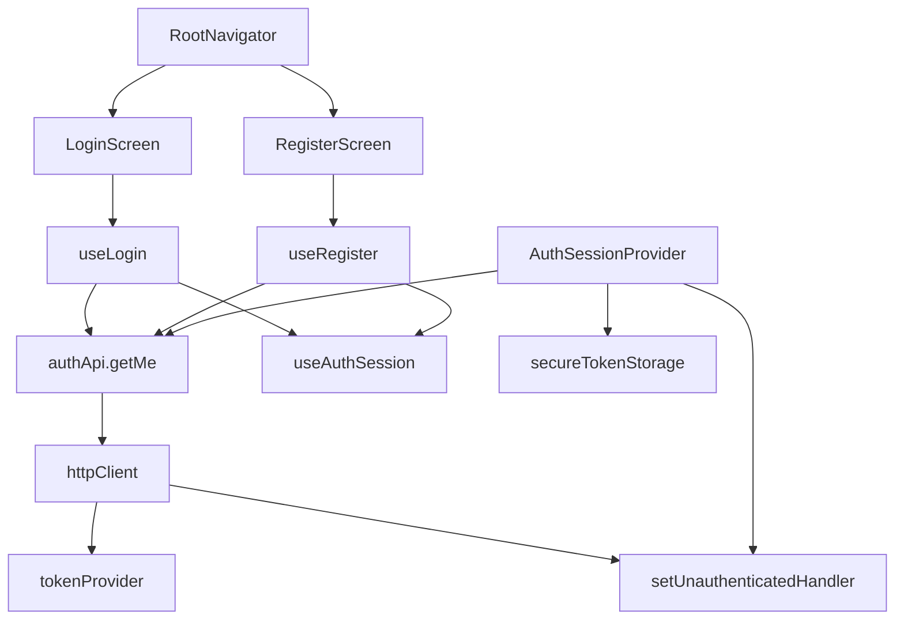
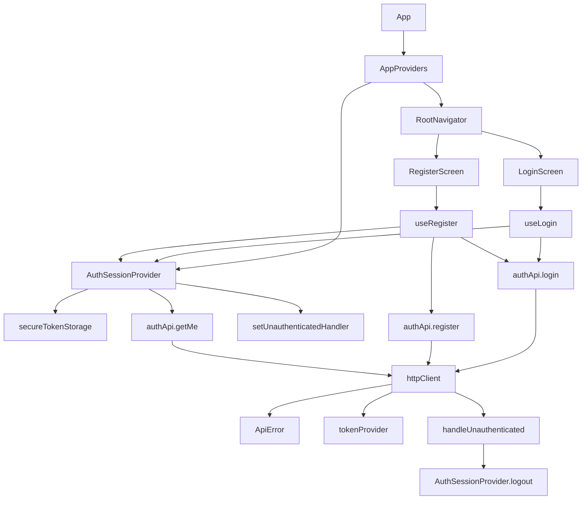

# FlowPay Mobile — Auth Module

## Overview

Implement the auth module for the mobile app: real Login and Register screens backed by `POST /auth/login`, `POST /auth/register`, and `GET /auth/me`. Adds a typed API client for auth endpoints, session restore with user population, and a `401` response interceptor for automatic logout on token expiry.

After this plan the app runs a complete auth cycle: register → auto-login → Home → token expiry → redirect to Login.

---

## Files Analyzed

### Backend

1. `backend/src/flowpay/auth/adapters/router.py` (119 lines)
   - `POST /auth/register` → 201 `{ user: { id, username }, wallet: { id, currency, balance } }`
   - `POST /auth/login` → 200 `{ access_token, token_type, expires_in: 3600, user: { id, username } }`
   - `GET /auth/me` → 200 `{ user: { id, username } }`, requires `Authorization: Bearer`
   - Error shape on all endpoints: `{ error: { code, message } }`

2. `backend/src/flowpay/auth/application/auth_service.py` (64 lines)
   - `login` raises `InvalidCredentialsError` → 401 `invalid_credentials`
   - `get_by_id` returns `None` if not found → 404 `user_not_found`

3. `backend/src/flowpay/auth/application/registration_service.py` (38 lines)
   - `register` creates user + wallet + welcome bonus atomically
   - On duplicate username raises `UsernameAlreadyExistsError` → 409 `username_already_exists`

4. `backend/tests/integration/auth/test_login.py`
   - Confirms 200 with `expires_in: 3600` and `user` object on success
   - Confirms 401 `invalid_credentials` on wrong password or unknown user

5. `backend/tests/integration/auth/test_register.py`
   - Confirms 201 with `user.id` prefixed `usr_`, `wallet.id` prefixed `wal_`
   - Confirms `wallet.balance == 50_000` (welcome bonus in COP)
   - Confirms 409 `username_already_exists` on duplicate

6. `backend/tests/integration/auth/test_me.py`
   - Confirms 200 `{ user }` with valid token
   - Confirms 401 `unauthenticated` on missing, invalid, or expired token

7. `docs/specs/04-api-contract.md`
   - Error shape confirmed: `{ error: { code, message } }`
   - Passwords never returned. Tokens must not contain financial data.

8. `docs/adr/0005-auth-strategy.md`
   - Token expiry: 1 hour. No refresh tokens in scope.
   - Mobile must use secure storage for the token.
   - On expired/invalid token: require login again.

### Mobile (current state)

9. `mobile/src/modules/auth/providers/AuthSessionProvider.tsx` (67 lines)
   - Lines 24–42: restores token from storage without calling `/auth/me` → `user` stays `null`.
   - `login(accessToken, user)` expects both token AND user object.
   - `logout()` clears storage and resets state.

10. `mobile/src/shared/api/httpClient.ts` (16 lines)
    - Request interceptor injects `Authorization` header.
    - No response interceptor for 401 yet.

11. `mobile/src/shared/api/tokenProvider.ts` (11 lines)
    - Callback registry pattern: `setAccessTokenProvider` / `getAccessToken`.
    - Used by `httpClient` without knowing about `expo-secure-store`.

12. `mobile/src/app/navigation/RootNavigator.tsx` (54 lines)
    - Lines 474–493: Login and Register use `PlaceholderScreen`.
    - Lines 508–524: guards on `accessToken` presence. No `user` dependency.

13. `mobile/src/app/navigation/types.ts` (9 lines)
    - `PublicStackParamList`: `Login`, `Register` (no params).
    - `ProtectedStackParamList`: `Home`, `Transfer`.

---

## Dependency Analysis



`shared/api` has no knowledge of `modules/auth`. The two cross-cutting integrations (token injection, 401 logout) use the same callback registry pattern.

---

## Proposed Changes

### Files to Create

#### 1. `mobile/src/shared/api/unauthenticatedHandler.ts` (~10 lines)

```typescript
type Handler = () => void

let handler: Handler = () => {}

export function setUnauthenticatedHandler(fn: Handler) {
  handler = fn
}

export function handleUnauthenticated() {
  handler()
}
```

Rationale: mirrors `tokenProvider.ts`. `httpClient` calls `handleUnauthenticated()` on 401 without importing anything from `modules/auth`. `AuthSessionProvider` registers `logout` once on mount.

---

#### 2. `mobile/src/shared/api/apiError.ts` (~12 lines)

```typescript
export class ApiError extends Error {
  constructor(
    public readonly status: number | undefined,
    public readonly code: string | undefined,
    message: string,
  ) {
    super(message)
    this.name = 'ApiError'
  }
}
```

Rationale: keeps Axios-specific error parsing inside `shared/api`. Feature modules should depend on FlowPay's HTTP error contract, not on Axios classes or helpers.

---

#### 3. `mobile/src/modules/auth/api/authApi.ts` (~55 lines)

```typescript
import { ApiError } from '../../../shared/api/apiError'
import { httpClient } from '../../../shared/api/httpClient'
import type { User } from '../types'

export class AuthApiError extends Error {
  constructor(public readonly code: string, message: string) {
    super(message)
    this.name = 'AuthApiError'
  }
}

function extractApiError(error: unknown): never {
  if (error instanceof ApiError && error.code) {
    throw new AuthApiError(error.code, error.message)
  }
  throw error
}

export async function login(username: string, password: string): Promise<{ accessToken: string; user: User }> {
  try {
    const { data } = await httpClient.post('/auth/login', { username, password })
    return {
      accessToken: data.access_token,
      user: { id: data.user.id, username: data.user.username },
    }
  } catch (error) {
    extractApiError(error)
  }
}

export async function register(username: string, password: string): Promise<{ user: User }> {
  try {
    const { data } = await httpClient.post('/auth/register', { username, password })
    return { user: { id: data.user.id, username: data.user.username } }
  } catch (error) {
    extractApiError(error)
  }
}

export async function getMe(): Promise<User> {
  const { data } = await httpClient.get('/auth/me')
  return { id: data.user.id, username: data.user.username }
}
```

Rationale:
- `AuthApiError` carries the backend `code` so hooks can show the right message without parsing strings.
- `authApi.ts` does not import Axios. Replacing Axios with `fetch` should only require changing `shared/api`.
- `register` only returns `user` — the wallet data is not needed for the auth flow and belongs to a future wallet module.
- `getMe` does not wrap in try/catch: a 401 will propagate to the response interceptor, which handles logout.

---

#### 4. `mobile/src/modules/auth/hooks/useLogin.ts` (~35 lines)

```typescript
import { useState } from 'react'
import { login as apiLogin, AuthApiError } from '../api/authApi'
import { useAuthSession } from './useAuthSession'

export function useLogin() {
  const { login } = useAuthSession()
  const [isLoading, setIsLoading] = useState(false)
  const [error, setError] = useState<string | null>(null)

  async function submit(username: string, password: string) {
    setIsLoading(true)
    setError(null)
    try {
      const result = await apiLogin(username, password)
      await login(result.accessToken, result.user)
    } catch (err) {
      if (err instanceof AuthApiError && err.code === 'invalid_credentials') {
        setError('Usuario o contraseña incorrectos')
      } else {
        setError('Error de conexión. Intenta de nuevo.')
      }
    } finally {
      setIsLoading(false)
    }
  }

  return { submit, isLoading, error }
}
```

---

#### 5. `mobile/src/modules/auth/hooks/useRegister.ts` (~40 lines)

```typescript
import { useState } from 'react'
import { register as apiRegister, login as apiLogin, AuthApiError } from '../api/authApi'
import { useAuthSession } from './useAuthSession'

export function useRegister() {
  const { login } = useAuthSession()
  const [isLoading, setIsLoading] = useState(false)
  const [error, setError] = useState<string | null>(null)

  async function submit(username: string, password: string) {
    setIsLoading(true)
    setError(null)
    try {
      await apiRegister(username, password)
      const result = await apiLogin(username, password)
      await login(result.accessToken, result.user)
    } catch (err) {
      if (err instanceof AuthApiError) {
        if (err.code === 'username_already_exists') {
          setError('Ese nombre de usuario ya está en uso')
        } else {
          setError('Error al registrarse. Intenta de nuevo.')
        }
      } else {
        setError('Error de conexión. Intenta de nuevo.')
      }
    } finally {
      setIsLoading(false)
    }
  }

  return { submit, isLoading, error }
}
```

Rationale: register + auto-login are two API calls, not one. If register succeeds but login fails (unlikely but possible on network flap), the user is redirected to Login with an existing account.

---

#### 6. `mobile/src/modules/auth/screens/LoginScreen.tsx` (~55 lines)

```typescript
import React, { useState } from 'react'
import { ActivityIndicator, Button, StyleSheet, Text, TextInput, View } from 'react-native'
import { useNavigation } from '@react-navigation/native'
import type { NativeStackNavigationProp } from '@react-navigation/native-stack'
import type { PublicStackParamList } from '../../../app/navigation/types'
import { useLogin } from '../hooks/useLogin'

type Nav = NativeStackNavigationProp<PublicStackParamList, 'Login'>

export function LoginScreen() {
  const navigation = useNavigation<Nav>()
  const [username, setUsername] = useState('')
  const [password, setPassword] = useState('')
  const { submit, isLoading, error } = useLogin()

  return (
    <View style={styles.container}>
      <Text style={styles.title}>FlowPay</Text>
      <TextInput
        style={styles.input}
        placeholder="Usuario"
        autoCapitalize="none"
        value={username}
        onChangeText={setUsername}
      />
      <TextInput
        style={styles.input}
        placeholder="Contraseña"
        secureTextEntry
        value={password}
        onChangeText={setPassword}
      />
      {error ? <Text style={styles.error}>{error}</Text> : null}
      {isLoading ? (
        <ActivityIndicator style={styles.action} />
      ) : (
        <Button title="Entrar" onPress={() => submit(username, password)} />
      )}
      <Button title="Crear cuenta" onPress={() => navigation.navigate('Register')} />
    </View>
  )
}

const styles = StyleSheet.create({
  container: { flex: 1, justifyContent: 'center', padding: 24 },
  title: { fontSize: 28, fontWeight: 'bold', marginBottom: 32, textAlign: 'center' },
  input: { borderWidth: 1, borderColor: '#ccc', borderRadius: 8, padding: 12, marginBottom: 12 },
  error: { color: 'red', marginBottom: 12 },
  action: { marginVertical: 8 },
})
```

---

#### 7. `mobile/src/modules/auth/screens/RegisterScreen.tsx` (~55 lines)

```typescript
import React, { useState } from 'react'
import { ActivityIndicator, Button, StyleSheet, Text, TextInput, View } from 'react-native'
import { useNavigation } from '@react-navigation/native'
import type { NativeStackNavigationProp } from '@react-navigation/native-stack'
import type { PublicStackParamList } from '../../../app/navigation/types'
import { useRegister } from '../hooks/useRegister'

type Nav = NativeStackNavigationProp<PublicStackParamList, 'Register'>

export function RegisterScreen() {
  const navigation = useNavigation<Nav>()
  const [username, setUsername] = useState('')
  const [password, setPassword] = useState('')
  const { submit, isLoading, error } = useRegister()

  return (
    <View style={styles.container}>
      <Text style={styles.title}>Crear cuenta</Text>
      <TextInput
        style={styles.input}
        placeholder="Usuario"
        autoCapitalize="none"
        value={username}
        onChangeText={setUsername}
      />
      <TextInput
        style={styles.input}
        placeholder="Contraseña"
        secureTextEntry
        value={password}
        onChangeText={setPassword}
      />
      {error ? <Text style={styles.error}>{error}</Text> : null}
      {isLoading ? (
        <ActivityIndicator style={styles.action} />
      ) : (
        <Button title="Crear cuenta" onPress={() => submit(username, password)} />
      )}
      <Button title="Ya tengo cuenta" onPress={() => navigation.goBack()} />
    </View>
  )
}

const styles = StyleSheet.create({
  container: { flex: 1, justifyContent: 'center', padding: 24 },
  title: { fontSize: 24, fontWeight: 'bold', marginBottom: 32, textAlign: 'center' },
  input: { borderWidth: 1, borderColor: '#ccc', borderRadius: 8, padding: 12, marginBottom: 12 },
  error: { color: 'red', marginBottom: 12 },
  action: { marginVertical: 8 },
})
```

---

### Files to Modify

#### 8. `mobile/src/shared/api/httpClient.ts`

**Current state (lines 1–16):**
```typescript
import axios from 'axios'
import { getAccessToken } from './tokenProvider'

export const httpClient = axios.create({
  baseURL: process.env.EXPO_PUBLIC_API_URL ?? 'http://localhost:8000',
})

httpClient.interceptors.request.use(async (config) => {
  const token = await getAccessToken()

  if (token) {
    config.headers.Authorization = `Bearer ${token}`
  }

  return config
})
```

**Proposed (lines 1–35):**
```typescript
import axios from 'axios'
import { ApiError } from './apiError'
import { getAccessToken } from './tokenProvider'
import { handleUnauthenticated } from './unauthenticatedHandler'

export const httpClient = axios.create({
  baseURL: process.env.EXPO_PUBLIC_API_URL ?? 'http://localhost:8000',
})

httpClient.interceptors.request.use(async (config) => {
  const token = await getAccessToken()

  if (token) {
    config.headers.Authorization = `Bearer ${token}`
  }

  return config
})

httpClient.interceptors.response.use(
  (response) => response,
  (error) => {
    if (axios.isAxiosError(error) && error.response?.status === 401) {
      handleUnauthenticated()
    }

    if (axios.isAxiosError(error)) {
      const apiError = error.response?.data?.error
      return Promise.reject(
        new ApiError(
          error.response?.status,
          apiError?.code,
          apiError?.message ?? 'Request failed',
        ),
      )
    }

    return Promise.reject(error)
  },
)
```

Changes: +18 lines. Import `ApiError` and `handleUnauthenticated`, add response interceptor, and normalize Axios errors into FlowPay HTTP errors.

---

#### 9. `mobile/src/modules/auth/providers/AuthSessionProvider.tsx`

**Current state (lines 1–2 and 24–42):**
```typescript
import React, { createContext, useCallback, useEffect, useMemo, useState } from 'react'
import type { User } from '../types'
// ...

  useEffect(() => {
    let isMounted = true

    getStoredAccessToken()
      .then((storedToken) => {
        if (isMounted) {
          setAccessToken(storedToken)
        }
      })
      .finally(() => {
        if (isMounted) {
          setIsRestoringSession(false)
        }
      })

    return () => {
      isMounted = false
    }
  }, [])
```

**Proposed — imports (lines 1–9):**
```typescript
import React, { createContext, useCallback, useEffect, useMemo, useState } from 'react'
import { getMe } from '../api/authApi'
import { setUnauthenticatedHandler } from '../../../shared/api/unauthenticatedHandler'
import type { User } from '../types'
import {
  clearStoredAccessToken,
  getStoredAccessToken,
  saveAccessToken,
} from '../storage/secureTokenStorage'
```

**Proposed — session restore useEffect (replaces lines 24–42):**
```typescript
  useEffect(() => {
    let isMounted = true

    async function restoreSession() {
      const storedToken = await getStoredAccessToken()
      if (!storedToken) return

      try {
        const me = await getMe()
        if (isMounted) {
          setAccessToken(storedToken)
          setUser(me)
        }
      } catch {
        await clearStoredAccessToken()
      }
    }

    restoreSession().finally(() => {
      if (isMounted) setIsRestoringSession(false)
    })

    return () => {
      isMounted = false
    }
  }, [])
```

**Proposed — unauthenticated handler registration (new useEffect after existing logout useCallback):**
```typescript
  useEffect(() => {
    setUnauthenticatedHandler(logout)
    return () => setUnauthenticatedHandler(() => {})
  }, [logout])
```

Changes: +8 lines added, ~10 lines modified. Session restore now calls `getMe()` to populate `user` and handles expired tokens. `logout` is registered as the 401 handler.

---

#### 10. `mobile/src/app/navigation/RootNavigator.tsx`

**Current state (lines 1–9 and relevant screen render sections):**
```typescript
import { NavigationContainer } from '@react-navigation/native'
import { createNativeStackNavigator } from '@react-navigation/native-stack'
import { ActivityIndicator, Text, View } from 'react-native'
import { useAuthSession } from '../../modules/auth/hooks/useAuthSession'
import type { ProtectedStackParamList, PublicStackParamList } from './types'
// ...
      <PublicStack.Screen name="Login">
        {() => <PlaceholderScreen name="Login" />}
      </PublicStack.Screen>
      <PublicStack.Screen name="Register">
        {() => <PlaceholderScreen name="Register" />}
      </PublicStack.Screen>
```

**Proposed — imports (lines 1–7):**
```typescript
import { NavigationContainer } from '@react-navigation/native'
import { createNativeStackNavigator } from '@react-navigation/native-stack'
import { ActivityIndicator, Text, View } from 'react-native'
import { LoginScreen } from '../../modules/auth/screens/LoginScreen'
import { RegisterScreen } from '../../modules/auth/screens/RegisterScreen'
import { useAuthSession } from '../../modules/auth/hooks/useAuthSession'
import type { ProtectedStackParamList, PublicStackParamList } from './types'
```

**Proposed — PublicNavigator screens (replace lines ~482–493):**
```typescript
      <PublicStack.Screen name="Login" component={LoginScreen} />
      <PublicStack.Screen name="Register" component={RegisterScreen} />
```

**Remove `PlaceholderScreen` component** (lines 474–480) only if it is no longer used by any screen. `Home` and `Transfer` in `ProtectedStack` still use it, so keep it.

Changes: +2 imports, -4 lines in screen render (inline render functions → `component` prop).

---

#### 11. `mobile/package.json`

Add the mobile test script and Jest preset:

```json
{
  "scripts": {
    "test": "jest"
  },
  "jest": {
    "preset": "jest-expo"
  }
}
```

Add dev dependencies through Expo/npm as listed in the Testing Strategy.

---

## Implementation Steps

### Step 1 — Create `unauthenticatedHandler.ts`

Create `mobile/src/shared/api/unauthenticatedHandler.ts` as specified above.

### Step 2 — Create `apiError.ts`

Create `mobile/src/shared/api/apiError.ts` as specified above.

### Step 3 — Create `authApi.ts`

Create `mobile/src/modules/auth/api/authApi.ts` as specified above.

### Step 4 — Create hooks

Create `mobile/src/modules/auth/hooks/useLogin.ts` and `useRegister.ts` as specified above.

### Step 5 — Create screens

Create `mobile/src/modules/auth/screens/LoginScreen.tsx` and `RegisterScreen.tsx` as specified above.

### Step 6 — Modify `httpClient.ts`

Add `import { ApiError }`, `import { handleUnauthenticated }`, and the response interceptor as specified above.

### Step 7 — Modify `AuthSessionProvider.tsx`

- Add imports for `getMe` and `setUnauthenticatedHandler`.
- Replace session restore `useEffect` with async `restoreSession()`.
- Add `setUnauthenticatedHandler(logout)` effect.

### Step 8 — Modify `RootNavigator.tsx`

- Replace inline render functions for Login and Register with `component={LoginScreen}` and `component={RegisterScreen}`.
- Add imports for both screen components.

### Step 9 — Add minimal test setup

Install Jest dependencies, add the `test` script, and configure `jest-expo`.

### Step 10 — Create minimal tests

Create:

- `mobile/src/modules/auth/api/authApi.test.ts`
- `mobile/src/shared/api/unauthenticatedHandler.test.ts`
- `mobile/src/modules/auth/providers/AuthSessionProvider.test.tsx`

### Step 11 — Type check and test

```bash
cd /Users/angelbrand/Workspace/Personal/flowpay/mobile
npx tsc --noEmit
npm test -- --runInBand
```

Expected: no errors.

### Step 12 — Manual validation on device

Start the backend:
```bash
cd /Users/angelbrand/Workspace/Personal/flowpay
docker-compose up
```

Start Metro (with USB tunnel already active):
```bash
cd /Users/angelbrand/Workspace/Personal/flowpay/mobile
npx expo start --dev-client
```

Validation flows:
1. App opens → shows Login screen (no token).
2. Tap "Crear cuenta" → Register screen.
3. Enter username/password → tap "Crear cuenta" → auto-login → Home screen.
4. Kill and reopen app → stays on Home (token restored + `user` populated from `/auth/me`).
5. From a second device or Postman, wait for token expiry (or manually test with a bad token in SecureStore) → app redirects to Login.
6. Login with wrong password → shows "Usuario o contraseña incorrectos".
7. Register duplicate username → shows "Ese nombre de usuario ya está en uso".

---

## Architecture Diagram



---

## Scope Boundaries

### What WILL be implemented

- `auth/api/authApi.ts` — `login`, `register`, `getMe` with `AuthApiError`.
- `auth/hooks/useLogin.ts` — form flow, error mapping, session update.
- `auth/hooks/useRegister.ts` — register + auto-login flow, error mapping.
- `auth/screens/LoginScreen.tsx` — username/password form, navigate to Register.
- `auth/screens/RegisterScreen.tsx` — username/password form, navigate back to Login.
- `shared/api/apiError.ts` — FlowPay HTTP error wrapper so Axios does not leak into feature modules.
- `shared/api/unauthenticatedHandler.ts` — callback registry for 401.
- `httpClient.ts` response interceptor — calls `handleUnauthenticated` on 401.
- `AuthSessionProvider` — `getMe()` on session restore to populate `user`, register logout as unauthenticated handler.
- `RootNavigator` — wire real screens.
- Minimal Jest test setup for mobile auth.
- `auth/api/authApi.test.ts` — response mapping and backend error-code mapping.
- `shared/api/unauthenticatedHandler.test.ts` — callback registry behavior.
- `auth/providers/AuthSessionProvider.test.tsx` — valid restore, expired restore cleanup, and logout handler behavior.

### What will NOT be implemented

- No form validation library (single-field non-empty check is sufficient for MVP).
- No `KeyboardAvoidingView` or scroll handling (deferred until design phase).
- No visual design system, custom buttons, or brand colors (placeholder UI only).
- No password strength requirements or confirmation field on Register.
- No "Forgot password" flow.
- No refresh token flow (out of scope per ADR 0005).
- No toast notifications — inline error text only.
- No wallet display on Home screen (next module).
- No full navigation integration tests (deferred until a broader mobile testing plan).
- No visual/snapshot tests for placeholder UI.

### Assumptions

- Backend is running and reachable at `EXPO_PUBLIC_API_URL`.
- `POST /auth/register` always returns 201 with `user.id` and `user.username` (confirmed by integration tests).
- `POST /auth/login` always returns `access_token` and `user` on 200 (confirmed by integration tests).
- `GET /auth/me` returns 401 `unauthenticated` on expired/invalid token (confirmed by integration tests).
- Navigation from Login to Home happens automatically via `RootNavigator` guard on `accessToken` — no explicit `navigation.navigate('Home')` needed in the hook.

---

## Testing Strategy

### Automated

Add a small Jest setup for React Native/Expo:

```bash
cd /Users/angelbrand/Workspace/Personal/flowpay/mobile
npx expo install --dev jest-expo jest @types/jest react-test-renderer
npm install --save-dev @testing-library/react-native
```

Modify `mobile/package.json`:

```json
{
  "scripts": {
    "test": "jest"
  },
  "jest": {
    "preset": "jest-expo"
  }
}
```

Create these minimal tests:

1. `mobile/src/modules/auth/api/authApi.test.ts`
   - Mocks `httpClient`.
   - `login()` maps `access_token` to `accessToken` and returns `{ user }`.
   - `register()` returns only `{ user }` and ignores wallet payload.
   - rejected `ApiError` with backend `code` becomes `AuthApiError`.

2. `mobile/src/shared/api/unauthenticatedHandler.test.ts`
   - `handleUnauthenticated()` calls the registered handler once.
   - resetting the handler to a no-op prevents stale logout callbacks across tests.

3. `mobile/src/modules/auth/providers/AuthSessionProvider.test.tsx`
   - With stored valid token, provider calls `getMe()` and exposes `accessToken` + `user`.
   - With stored expired/invalid token, provider clears secure storage and leaves session unauthenticated.
   - Registered unauthenticated handler calls `logout()`, clears token, and resets user.

Run:

```bash
npx tsc --noEmit
npm test -- --runInBand
```

### Manual flows

| Flow | Expected result |
|---|---|
| Open app with no token | Login screen |
| Open app with valid stored token | Home screen, `user` populated |
| Open app with expired token | Login screen, token cleared |
| Login with valid credentials | Home screen |
| Login with wrong password | Inline error "Usuario o contraseña incorrectos" |
| Login with unknown user | Inline error "Usuario o contraseña incorrectos" |
| Register with new username | Home screen (register + auto-login) |
| Register with duplicate username | Inline error "Ese nombre de usuario ya está en uso" |
| Navigate Login → Register → back | Navigation works in both directions |

### Tests still deferred intentionally

- Hook unit tests for `useLogin` and `useRegister`; current coverage is through adapter/session boundaries.
- Navigation integration tests (no framework chosen yet).

---

## Rollback Plan

If a step fails, revert with:

```bash
git revert HEAD
```

No database migrations or native build changes are involved. TypeScript compilation (`tsc --noEmit`) must pass before testing on device.

---

## Success Criteria

- [ ] `npx tsc --noEmit` passes with no errors.
- [ ] `npm test -- --runInBand` passes.
- [ ] Login screen visible on app open (no stored token).
- [ ] Successful login navigates to Home.
- [ ] Successful register navigates to Home (via auto-login).
- [ ] App reopened with valid token shows Home with `user` populated.
- [ ] App reopened with expired token shows Login.
- [ ] Wrong credentials show inline error, not crash.
- [ ] Duplicate register shows inline error, not crash.
- [ ] No screen imports `axios` or `expo-secure-store` directly.
- [ ] No feature module imports `axios` directly; Axios is contained in `shared/api/httpClient.ts`.
- [ ] `shared/api/httpClient.ts` does not import from `modules/auth`.

---

## TL;DR

- Total files to modify: 4 (`package.json`, `httpClient.ts`, `AuthSessionProvider.tsx`, `RootNavigator.tsx`)
- Total files to create: 10 (`apiError.ts`, `unauthenticatedHandler.ts`, `authApi.ts`, `useLogin.ts`, `useRegister.ts`, `LoginScreen.tsx`, `RegisterScreen.tsx`, `authApi.test.ts`, `unauthenticatedHandler.test.ts`, `AuthSessionProvider.test.tsx`)
- Total estimated lines: ~440 added / ~15 removed / ~25 modified
- Key deliverables: real Login + Register screens, typed auth API client, session restore with `user`, 401 auto-logout, minimal auth/session tests
- What will NOT be included: UI polish, validation library, password strength, wallet screen, refresh tokens

## Team TL;DR

**What we're building**: Pantallas reales de Login y Registro conectadas al backend — los usuarios ya pueden crear cuentas e iniciar sesión en el app desde el dispositivo físico.

**Why it matters**: Sin auth funcional no hay sesión, y sin sesión no hay transferencias ni wallet. Este módulo desbloquea todo el desarrollo de producto restante.

**Timeline impact**: Después de este módulo se puede implementar el wallet y el flujo de transferencia directamente, sin bloqueos de infraestructura.
