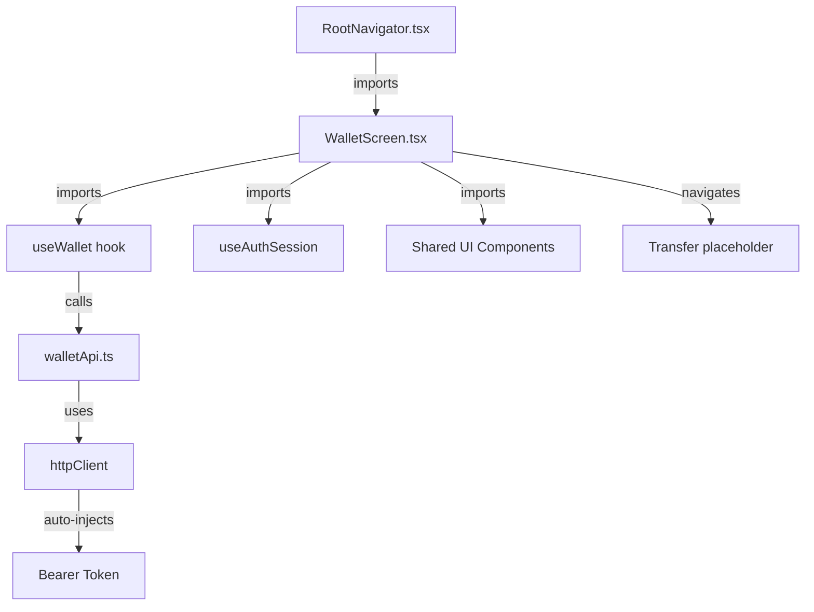

# Mobile Wallet Screen

## Overview

Create the Wallet Screen that completely replaces the current HomeScreen. This will be the app's post-login entry point where the user sees their backend-derived balance, wallet details, and the primary action to start a transfer.

The screen follows the existing modular architecture: API client → hook → screen.

Architecture constraints:
- Wallet balance is server-authoritative display data, never client authority.
- The client sends no wallet ID when reading the authenticated user's wallet.
- Navigation should expose only implemented or explicitly disabled user paths.
- Layout must respect the existing `Screen` wrapper behavior: child layouts that rely on `marginTop: 'auto'` need a flex container.

---

## Files Analyzed

### Core Mobile Files
1. **`mobile/src/app/screens/HomeScreen.tsx`** (26 lines)
   - Current implementation: Simple greeting screen
   - Will be completely replaced by WalletScreen
   - Located at Home route in ProtectedNavigator

2. **`mobile/src/app/navigation/RootNavigator.tsx`** (58 lines)
   - Line 33: `<ProtectedStack.Screen name="Home" component={HomeScreen} />`
   - Needs update to import and use WalletScreen
   - Line 34-36: Placeholder Transfer screen already exists

3. **`mobile/src/app/navigation/types.ts`** (9 lines)
   - Defines `ProtectedStackParamList` with `Home` and `Transfer`
   - Will rename `Home` → `Wallet`

4. **`mobile/src/modules/auth/providers/AuthSessionProvider.tsx`** (81 lines)
   - Provides: `user`, `accessToken`, `isRestoringSession`, `login`, `logout`
   - WalletScreen will consume `user` and `logout`

5. **`mobile/src/modules/auth/api/authApi.ts`** (44 lines)
   - Pattern: `async function name(): Promise<Type>` via httpClient
   - Error handling with `extractApiError(error)`
   - walletApi.ts follows the same pattern

6. **`mobile/src/modules/auth/hooks/useLogin.ts`** (29 lines)
   - Pattern: `useState` for loading/error, async function
   - useWallet follows the same shape

7. **`mobile/src/shared/api/httpClient.ts`** (41 lines)
   - axios instance with Bearer token injection via interceptor
   - Automatic 401 handling via unauthenticatedHandler

8. **`mobile/src/app/AppProviders.tsx`** (16 lines)
   - React Query `QueryClient` already configured at the app level

### Backend API Specification

**GET /wallet** (from `docs/specs/04-api-contract.md` lines 149–176)

Response `200 OK`:
```json
{
  "wallet": {
    "id": "wal_123",
    "currency": "COP",
    "balance": 45000
  }
}
```

Errors:
- `401 unauthenticated`
- `404 wallet_not_found`

Rules:
- Wallet derived from authenticated user — client sends no wallet ID
- Balance derived from ledger transactions (backend is authoritative)
- Amounts are positive integers in Colombian pesos (COP)

---

## Current State Analysis

```
mobile/src/
  app/
    screens/HomeScreen.tsx   (26 lines) ← TO BE DELETED
    navigation/
      RootNavigator.tsx      (58 lines) ← MODIFY
      types.ts               (9 lines)  ← MODIFY
  modules/
    auth/
      api/authApi.ts         (44 lines) ← PATTERN REFERENCE
      hooks/useLogin.ts      (29 lines) ← PATTERN REFERENCE
      types.ts               (4 lines)  ← PATTERN REFERENCE
    wallet/                            ← POPULATE
      .gitkeep
  shared/
    ui/                                ← ready to use
    api/httpClient.ts        (41 lines) ← ready to use
```

---

## Dependency Analysis



---

## Proposed Changes

### Production Files to Create

#### 1. `mobile/src/modules/wallet/types.ts` (~12 lines)

```typescript
export interface Wallet {
  id: string
  currency: string
  balance: number
}

export interface WalletResponse {
  wallet: Wallet
}
```

---

#### 2. `mobile/src/modules/wallet/api/walletApi.ts` (~40 lines)

Pattern mirrors `auth/api/authApi.ts`.

```typescript
import { ApiError } from '../../../shared/api/apiError'
import { httpClient } from '../../../shared/api/httpClient'
import type { Wallet, WalletResponse } from '../types'

export class WalletApiError extends Error {
  constructor(public readonly code: string, message: string) {
    super(message)
    this.name = 'WalletApiError'
  }
}

function extractApiError(error: unknown): never {
  if (error instanceof ApiError && error.code) {
    throw new WalletApiError(error.code, error.message)
  }
  throw error
}

export async function getWallet(): Promise<Wallet> {
  try {
    const { data } = await httpClient.get<WalletResponse>('/wallet')
    return data.wallet
  } catch (error) {
    extractApiError(error)
  }
}
```

**Integration Points**:
- `httpClient` from `shared/api/httpClient.ts:6`
- `ApiError` from `shared/api/apiError.ts`
- Pattern from `auth/api/authApi.ts:5-17`

---

#### 3. `mobile/src/modules/wallet/hooks/useWallet.ts` (~30 lines)

Uses React Query (already configured in `AppProviders.tsx`).

```typescript
import { useQuery } from '@tanstack/react-query'
import { getWallet, WalletApiError } from '../api/walletApi'
import type { Wallet } from '../types'

export function useWallet() {
  const { data: wallet, isLoading, error, refetch } = useQuery<Wallet, WalletApiError>({
    queryKey: ['wallet'],
    queryFn: getWallet,
    staleTime: 0,
  })

  const errorMessage = error
    ? error.code === 'wallet_not_found'
      ? 'Wallet not found'
      : 'Error loading wallet. Please try again.'
    : null

  return { wallet, isLoading, error: errorMessage, refetch }
}
```

**Integration Points**:
- `QueryClient` from `AppProviders.tsx:9`
- `walletApi.ts` from previous step

**State ownership**:
- `wallet.balance` is cached server state for display only.
- `staleTime: 0` keeps the wallet query immediately stale so it refetches on remount and remains easy to invalidate after financial mutations.
- Transfer completion must invalidate or refetch `['wallet']` when the transfer flow is implemented.

---

#### 4. `mobile/src/modules/wallet/screens/WalletScreen.tsx` (~110 lines)

```typescript
import React from 'react'
import { ActivityIndicator, StyleSheet, View } from 'react-native'
import { useNavigation } from '@react-navigation/native'
import type { NativeStackNavigationProp } from '@react-navigation/native-stack'
import type { ProtectedStackParamList } from '../../../app/navigation/types'
import { AppButton, AppText, Screen, theme } from '../../../shared/ui'
import { useAuthSession } from '../../auth/hooks/useAuthSession'
import { useWallet } from '../hooks/useWallet'

type Nav = NativeStackNavigationProp<ProtectedStackParamList, 'Wallet'>

function formatBalance(balance: number, currency: string): string {
  return `${currency} ${balance.toLocaleString('es-CO')}`
}

export function WalletScreen() {
  const navigation = useNavigation<Nav>()
  const { user, logout } = useAuthSession()
  const { wallet, isLoading, error, refetch } = useWallet()

  if (isLoading) {
    return (
      <Screen centered>
        <ActivityIndicator />
      </Screen>
    )
  }

  if (error || !wallet) {
    return (
      <Screen centered>
        <AppText variant="error" style={styles.errorText}>
          {error ?? 'Error loading wallet'}
        </AppText>
        <AppButton title="Retry" onPress={() => refetch()} style={styles.retryButton} />
        <AppButton title="Logout" variant="danger" onPress={logout} />
      </Screen>
    )
  }

  return (
    <Screen contentStyle={styles.content}>
      <View>
        <View style={styles.header}>
          <AppText variant="title" style={styles.appTitle}>
            FlowPay
          </AppText>
          <AppText variant="muted">{user?.username}</AppText>
        </View>

        <View style={styles.walletCard}>
          <AppText variant="muted" style={styles.balanceLabel}>
            Available balance
          </AppText>
          <AppText variant="title" style={styles.balanceAmount}>
            {formatBalance(wallet.balance, wallet.currency)}
          </AppText>
          <AppText variant="muted" style={styles.walletIdLabel}>
            Wallet
          </AppText>
          <AppText variant="muted" style={styles.walletId}>
            {formatWalletId(wallet.id)}
          </AppText>
        </View>

        <View style={styles.actions}>
          <AppButton title="Transfer" onPress={() => navigation.navigate('Transfer')} />
        </View>
      </View>

      <AppButton title="Logout" variant="danger" onPress={logout} />
    </Screen>
  )
}

const styles = StyleSheet.create({
  content: { flex: 1, justifyContent: 'space-between' },
  header: { alignItems: 'center', paddingTop: theme.spacing.xl, marginBottom: theme.spacing.xxl },
  appTitle: { marginBottom: theme.spacing.sm },
  walletCard: {
    backgroundColor: theme.colors.surface,
    borderWidth: 1,
    borderColor: theme.colors.border,
    borderRadius: theme.radius.lg,
    padding: theme.spacing.xl,
    alignItems: 'center',
    marginBottom: theme.spacing.xxl,
  },
  balanceLabel: { marginBottom: theme.spacing.sm },
  balanceAmount: { marginBottom: theme.spacing.md },
  walletIdLabel: { fontSize: theme.typography.small, marginBottom: theme.spacing.xs },
  walletId: { fontSize: theme.typography.small },
  actions: { gap: theme.spacing.sm, marginBottom: theme.spacing.xxl },
  errorText: { marginBottom: theme.spacing.lg, textAlign: 'center' },
  retryButton: { marginBottom: theme.spacing.md },
})
```

Add helper:

```typescript
function formatWalletId(walletId: string): string {
  if (walletId.length <= 14) return walletId
  return `${walletId.slice(0, 8)}...${walletId.slice(-6)}`
}
```

**UI notes**:
- `Screen` renders children inside a non-flex wrapper, so `contentStyle={styles.content}` is required for bottom-aligned logout behavior.
- Do not expose a working `History` button until the history screen exists. History remains a later feature.
- The wallet ID is displayed in truncated form to avoid making a long technical identifier the dominant UI element.

---

### Files to Modify

#### 1. `mobile/src/app/navigation/types.ts`

**Current (lines 6–9)**:
```typescript
export type ProtectedStackParamList = {
  Home: undefined
  Transfer: undefined
}
```

**Proposed**:
```typescript
export type ProtectedStackParamList = {
  Wallet: undefined
  Transfer: undefined
}
```

**Changes**: Rename `Home` → `Wallet` (line 7).

---

#### 2. `mobile/src/app/navigation/RootNavigator.tsx`

**Current (lines 4, 32–38)**:
```typescript
import { HomeScreen } from '../screens/HomeScreen'
// ...
function ProtectedNavigator() {
  return (
    <ProtectedStack.Navigator>
      <ProtectedStack.Screen name="Home" component={HomeScreen} />
      <ProtectedStack.Screen name="Transfer">
        {() => <PlaceholderScreen name="Transfer" />}
      </ProtectedStack.Screen>
    </ProtectedStack.Navigator>
  )
}
```

**Proposed**:
```typescript
import { WalletScreen } from '../../modules/wallet/screens/WalletScreen'
// ...
function ProtectedNavigator() {
  return (
    <ProtectedStack.Navigator>
      <ProtectedStack.Screen name="Wallet" component={WalletScreen} />
      <ProtectedStack.Screen name="Transfer">
        {() => <PlaceholderScreen name="Transfer" />}
      </ProtectedStack.Screen>
    </ProtectedStack.Navigator>
  )
}
```

**Changes**:
- Line 4: Import `WalletScreen` instead of `HomeScreen`
- Line 33: Screen name `"Home"` → `"Wallet"`, component `HomeScreen` → `WalletScreen`
- Keep `Transfer` placeholder route as the only exposed placeholder because it is the next primary flow already present in navigation

---

### Files to Delete
- `mobile/src/app/screens/HomeScreen.tsx` (26 lines) — functionality moved to WalletScreen

### Files NOT to Create
- No new providers
- No new context
- No migration scripts

---

## Implementation Steps

### Step 1: Create module structure and types
Create `mobile/src/modules/wallet/types.ts`, `api/` and `hooks/` directories.

**Verification**:
```bash
ls mobile/src/modules/wallet/
```

### Step 2: Create `walletApi.ts`
Create `mobile/src/modules/wallet/api/walletApi.ts`.

**Verification**:
```bash
cd mobile && npx tsc --noEmit
```

### Step 3: Create `useWallet.ts`
Create `mobile/src/modules/wallet/hooks/useWallet.ts`.

**Verification**:
```bash
cd mobile && npx tsc --noEmit
```

### Step 4: Create `WalletScreen.tsx`
Create `mobile/src/modules/wallet/screens/WalletScreen.tsx`.

**Verification**:
```bash
cd mobile && npx tsc --noEmit
```

### Step 5: Update navigation
Modify `types.ts` and `RootNavigator.tsx`.

**Verification**:
```bash
cd mobile && npx tsc --noEmit
grep -n "Wallet" mobile/src/app/navigation/RootNavigator.tsx
```

### Step 6: Delete HomeScreen
```bash
rm mobile/src/app/screens/HomeScreen.tsx
```

### Step 7: Add focused tests
Add wallet-module tests after the implementation compiles.

Recommended minimum:
- `walletApi.test.ts`: returns wallet from `/wallet`, maps `wallet_not_found`, propagates unauthenticated errors through existing API error handling.
- `useWallet` or `WalletScreen` test: renders loading, success balance, retry error state, and transfer button navigation.

### Step 8: Run tests
Run the full mobile verification after implementation and focused tests are in place.

**Verification**:
```bash
cd mobile && npm test && npx tsc --noEmit
```

---

## Scope Boundaries

### WILL be implemented
- `GET /wallet` API client function
- `useWallet` hook with React Query caching
- WalletScreen: balance display, wallet ID, loading state, error + retry
- Navigation: `Wallet` route and existing `Transfer` route
- Balance formatting for COP (integer pesos, locale `es-CO`)
- Logout from error state
- Focused wallet API/UI tests

### will NOT be implemented
- Transaction history inline, button, placeholder, or separate screen
- Transfer execution (Transfer screen remains placeholder)
- NFC integration
- Pull-to-refresh
- Animations or skeleton screens
- Dark mode

---

## Testing Strategy

### Manual Steps
1. Login → WalletScreen loads, shows balance
2. Balance displays in COP format
3. "Transfer" navigates to Transfer placeholder
4. Backend offline → error message + retry button shows
5. Retry → re-fetches wallet data
6. "Logout" → returns to Login
7. Wallet ID is truncated and does not crowd the balance UI

### Automated
```bash
cd mobile && npm test
# Existing tests and new wallet tests must pass
cd mobile && npx tsc --noEmit
# No TypeScript errors
```

---

## Rollback Plan

```bash
git revert HEAD
# Restores RootNavigator, types, and removes new wallet module files
```

No database changes — pure frontend.

---

## Success Criteria

- [ ] `npx tsc --noEmit` passes clean
- [ ] `npm test` — all existing tests pass
- [ ] WalletScreen shows balance from `/wallet` API
- [ ] Loading spinner visible while fetching
- [ ] Error state with retry button when API fails
- [ ] "Transfer" button navigates correctly
- [ ] No enabled History button or History placeholder route is exposed
- [ ] Logout returns to Login screen
- [ ] Wallet tests cover API success/error and screen loading/success/retry states

---

## TL;DR

| | |
|---|---|
| **Files to create** | 5-6 including focused tests |
| **Files to modify** | 2 |
| **Files to delete** | 1 |
| **Lines added** | ~250 |
| **Lines removed** | ~26 |
| **Lines modified** | ~7 |
| **Key deliverables** | `walletApi.ts`, `useWallet.ts`, `WalletScreen.tsx`, `types.ts`, focused tests |
| **Not included** | Transaction history, transfers, NFC, animations |

## Team TL;DR

**What we're building**: A wallet home screen showing the user's current COP balance and a primary path to transfers.

**Why it matters**: This replaces the placeholder HomeScreen and gives users actual financial context the moment they log in — the core value proposition of FlowPay.

**Timeline impact**: No blockers; all backend endpoints and mobile dependencies are already in place. Implement immediately after architecture review.
