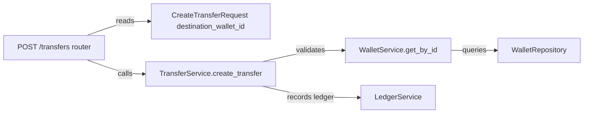
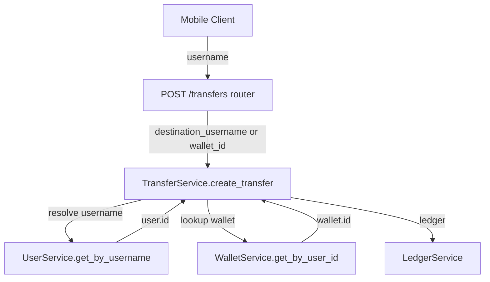

# Transfer Feature - Backend Plan

## Overview

Modify the `POST /transfers` endpoint to accept `destination_username` in addition to `destination_wallet_id`. The backend will resolve the username to a wallet ID internally. This enables the mobile client to initiate transfers by specifying a recipient username without needing a separate lookup call.

## Files Analyzed

### Backend Transfer Module

1. **`backend/src/flowpay/transfers/adapters/router.py`** (125 lines)
   - Purpose: HTTP endpoint definitions for transfer operations
   - Key endpoints: POST /transfers (line 54), GET /transfers/{id} (line 100)
   - Current request model: `CreateTransferRequest` with `destination_wallet_id`, `amount`, `origin`
   - Validates Idempotency-Key header, delegates to `TransferService`
   - Integration points: depends on `get_current_user_id`, `build_transfer_service`, error handling

2. **`backend/src/flowpay/transfers/application/transfer_service.py`** (154 lines)
   - Purpose: Business logic for transfer operations
   - Key method: `create_transfer()` (line 45-129) with parameters: `user_id`, `destination_wallet_id`, `amount`, `origin`, `idempotency_key`, `request_hash`
   - Validates: amount > 0, destination wallet exists, source != destination, sufficient balance
   - Handles: wallet locking, idempotency checks, ledger entry creation
   - Does NOT resolve username to wallet_id (receives wallet_id as parameter)

3. **`backend/src/flowpay/wallets/application/wallet_service.py`** (65 lines)
   - Purpose: Wallet data access layer
   - Key methods: `get_by_id()` (line 30), `get_by_user_id()` (line 42), `lock_by_user_id()` (line 54)
   - Does NOT have `get_by_username()` — cannot resolve username directly

4. **`backend/src/flowpay/users/application/user_service.py`** (48 lines)
   - Purpose: User data access layer
   - Key method: `get_by_username()` (line 42-47) returns `UserSummary` with id and username
   - Returns None if user not found
   - Integration: called from auth flows

5. **`backend/src/flowpay/composition.py`** (~unknown, need to check)
   - Purpose: Service composition (dependency injection)
   - Used in router to build `build_transfer_service(db)`
   - Must be updated to inject UserService into TransferService if needed

6. **`backend/tests/integration/transfers/test_transfers.py`** (403 lines)
   - Purpose: Integration tests for transfer endpoint
   - Tests: create, validation, idempotency, access control, concurrency
   - All tests use `destination_wallet_id` directly (lines 53, 71, 83, etc.)
   - Uses helper `_post_transfer()` (line 35-40) that constructs request
   - Tests will need updates to validate username resolution

### Users Module Integration

7. **`backend/src/flowpay/users/adapters/user_repository.py`** 
   - Purpose: Database adapter for user lookups
   - Key method: `get_by_username(username: str)` used by UserService

## Current State Analysis

### POST /transfers Request Model (Lines 28-31, router.py)

```python
class CreateTransferRequest(BaseModel):
    destination_wallet_id: str
    amount: int
    origin: str = "manual_transfer"
```

**Current behavior:**
- Client MUST provide `destination_wallet_id` directly
- No username resolution on backend
- Mobile cannot transfer by username without separate lookup call

### Transfer Service create_transfer() (Lines 45-53, transfer_service.py)

```python
def create_transfer(
    self,
    user_id: str,
    destination_wallet_id: str,
    amount: int,
    origin: str,
    idempotency_key: str,
    request_hash: str,
) -> TransferSummary:
```

**Current behavior:**
- Receives `destination_wallet_id` as parameter
- Validates wallet exists via `wallet_service.get_by_id(destination_wallet_id)`
- No username lookup capability

### Router Endpoint (Lines 54-97, router.py)

```python
@router.post("/transfers", status_code=201)
def create_transfer(
    body: CreateTransferRequest,
    idempotency_key: str | None = Header(None, alias="Idempotency-Key"),
    current_user_id: str = Depends(get_current_user_id),
    db: Session = Depends(get_db),
):
```

**Current behavior:**
- Receives request body with `destination_wallet_id`
- Calls service with wallet_id directly
- No username resolution

## Dependency Analysis



**Missing link for username resolution:**
- UserService exists but is not accessible to TransferService
- TransferService needs an application-layer way to resolve `destination_username` into a destination wallet
- Router should remain a thin HTTP adapter and must not orchestrate user/wallet lookup itself

## Proposed Changes

### Files to Modify

#### 1. `backend/src/flowpay/transfers/adapters/router.py`

**Lines 28-31 (Current):**
```python
class CreateTransferRequest(BaseModel):
    destination_wallet_id: str
    amount: int
    origin: str = "manual_transfer"
```

**Lines 28-32 (Proposed):**
```python
class CreateTransferRequest(BaseModel):
    destination_wallet_id: str | None = None
    destination_username: str | None = None
    amount: int
    origin: str = "manual_transfer"
```

**Rationale:**
- Accept both wallet_id and username for backwards compatibility and flexibility
- Keep request parsing in the HTTP adapter
- Delegate destination validation and resolution to the transfer application use case

**Changes:**
- Lines to add: ~1 (`destination_username`)
- Lines to edit: ~2 (model definition)

---

**Lines 54-97 (Current create_transfer function):**
```python
@router.post("/transfers", status_code=201)
def create_transfer(
    body: CreateTransferRequest,
    idempotency_key: str | None = Header(None, alias="Idempotency-Key"),
    current_user_id: str = Depends(get_current_user_id),
    db: Session = Depends(get_db),
):
    if idempotency_key is None:
        raise FlowPayHTTPError(
            code="invalid_request",
            message="Idempotency-Key header is required",
            status_code=400,
        )

    request_hash = _request_hash(body.model_dump())

    service = build_transfer_service(db)
    try:
        summary = service.create_transfer(
            user_id=current_user_id,
            destination_wallet_id=body.destination_wallet_id,
            amount=body.amount,
            origin=body.origin,
            idempotency_key=idempotency_key,
            request_hash=request_hash,
        )
    except IdempotencyReplayError as e:
        return JSONResponse(status_code=e.response_status, content={"transfer": e.response_body})
    except TransferError as e:
        status_code = _ERROR_STATUS.get(e.code, 400)
        raise FlowPayHTTPError(code=e.code, message=e.message, status_code=status_code)

    return TransferEnvelope(
        transfer=TransferResponse(
            id=summary.id,
            source_wallet_id=summary.source_wallet_id,
            destination_wallet_id=summary.destination_wallet_id,
            amount=summary.amount,
            currency=summary.currency,
            origin=summary.origin,
            status=summary.status,
            created_at=summary.created_at,
        )
    )
```

**Lines 54-100 (Proposed):**
```python
@router.post("/transfers", status_code=201)
def create_transfer(
    body: CreateTransferRequest,
    idempotency_key: str | None = Header(None, alias="Idempotency-Key"),
    current_user_id: str = Depends(get_current_user_id),
    db: Session = Depends(get_db),
):
    if idempotency_key is None:
        raise FlowPayHTTPError(
            code="invalid_request",
            message="Idempotency-Key header is required",
            status_code=400,
        )

    request_hash = _request_hash(body.model_dump())

    service = build_transfer_service(db)
    try:
        summary = service.create_transfer(
            user_id=current_user_id,
            destination_wallet_id=body.destination_wallet_id,
            destination_username=body.destination_username,
            amount=body.amount,
            origin=body.origin,
            idempotency_key=idempotency_key,
            request_hash=request_hash,
        )
    except IdempotencyReplayError as e:
        return JSONResponse(status_code=e.response_status, content={"transfer": e.response_body})
    except TransferError as e:
        status_code = _ERROR_STATUS.get(e.code, 400)
        raise FlowPayHTTPError(code=e.code, message=e.message, status_code=status_code)

    return TransferEnvelope(
        transfer=TransferResponse(
            id=summary.id,
            source_wallet_id=summary.source_wallet_id,
            destination_wallet_id=summary.destination_wallet_id,
            amount=summary.amount,
            currency=summary.currency,
            origin=summary.origin,
            status=summary.status,
            created_at=summary.created_at,
        )
    )
```

**Rationale:**
- Accept username at the API boundary without putting transfer orchestration in the router
- Keep the router responsible for HTTP concerns: request parsing, auth dependency, idempotency header presence, response/error mapping
- Keep destination validation and username resolution in `TransferService`, which owns transfer orchestration
- Maintains backwards compatibility (wallet_id still works)

**Changes:**
- Lines to add: ~1-2 (pass `destination_username` through)
- Lines to edit: ~5 (request body handling)

---

#### 2. `backend/src/flowpay/transfers/application/transfer_service.py`

**Current signature:**
```python
def create_transfer(
    self,
    user_id: str,
    destination_wallet_id: str,
    amount: int,
    origin: str,
    idempotency_key: str,
    request_hash: str,
) -> TransferSummary:
```

**Proposed signature:**
```python
def create_transfer(
    self,
    user_id: str,
    destination_wallet_id: str | None,
    destination_username: str | None,
    amount: int,
    origin: str,
    idempotency_key: str,
    request_hash: str,
) -> TransferSummary:
```

**Proposed behavior:**
- Validate exactly one of `destination_wallet_id` or `destination_username` is provided.
- If `destination_wallet_id` is provided, keep the existing destination-wallet validation path.
- If `destination_username` is provided:
  - call `user_service.get_by_username(destination_username)`;
  - return `destination_user_not_found` if no user exists;
  - call `wallet_service.get_by_user_id(user.id)`;
  - return `destination_wallet_not_found` if the user has no wallet;
  - continue the existing transfer flow using the resolved wallet id.
- Keep amount validation, source wallet locking, balance calculation, idempotency checks, transfer operation insert, and ledger writes inside the same transfer use case.

**Rationale:**
- `transfers` owns transfer orchestration.
- Username lookup is not a UI concern once it determines the authoritative destination wallet for a money-moving use case.
- The service already coordinates wallet locking, balance validation, idempotency, and ledger writes; recipient resolution belongs in that same application boundary.

**Changes:**
- Add `user_service` dependency to `TransferService.__init__`.
- Add exactly-one destination validation.
- Add private helper such as `_resolve_destination_wallet_id(...)` if it keeps `create_transfer()` readable.
- Preserve existing wallet-id path behavior.

---

#### 3. `backend/src/flowpay/composition.py`

**Check current state:**
```bash
grep -n "def build_" /Users/angelbrand/Workspace/Personal/flowpay/backend/src/flowpay/composition.py | head -20
```

**Expected addition:**
- If `build_user_service()` doesn't exist, add it
- Inject `build_user_service(db)` into `build_transfer_service(db)`

**Rationale:**
- TransferService needs access to the public `users` application service to resolve username before wallet lookup
- Router should not build or call user/wallet services directly

---

### Files to Create

None — all changes are modifications to existing files.

### Files NOT to Create

- No new endpoint-specific service classes
- No new domain models
- No separate endpoint for username lookup
- No migration scripts

## Implementation Steps

### Step 1: Read composition.py to verify service builders exist

```bash
grep -n "def build_user_service\|def build_wallet_service" /Users/angelbrand/Workspace/Personal/flowpay/backend/src/flowpay/composition.py
```

If `build_user_service()` is missing, add it. `build_wallet_service()` already exists in the current codebase.

**Files affected:**
- `backend/src/flowpay/composition.py`

**Verification:**
```bash
grep -A 3 "def build_user_service\|def build_wallet_service" /Users/angelbrand/Workspace/Personal/flowpay/backend/src/flowpay/composition.py
```

### Step 2: Modify CreateTransferRequest model

Update `backend/src/flowpay/transfers/adapters/router.py` lines 28-32 to make `destination_wallet_id` optional and add `destination_username` field.

**Files affected:**
- `backend/src/flowpay/transfers/adapters/router.py` lines 28-32

**Verification:**
```bash
grep -A 5 "class CreateTransferRequest" /Users/angelbrand/Workspace/Personal/flowpay/backend/src/flowpay/transfers/adapters/router.py
```

### Step 3: Update TransferService contract and destination resolution

Update `backend/src/flowpay/transfers/application/transfer_service.py` with:
- optional `destination_wallet_id`;
- optional `destination_username`;
- exactly-one destination validation;
- username → user → wallet_id resolution inside the application service;
- `destination_user_not_found` as a `TransferError`;
- existing destination wallet, same-wallet, lock, balance, ledger, and idempotency behavior preserved.

**Files affected:**
- `backend/src/flowpay/transfers/application/transfer_service.py`

**Verification:**
```bash
cd backend && python -m pytest tests/integration/transfers/test_transfers.py::test_create_manual_transfer_returns_201 -v
```

### Step 4: Keep router thin and pass both destination fields to service

Update `backend/src/flowpay/transfers/adapters/router.py` create_transfer function with:
- pass-through of `body.destination_wallet_id`;
- pass-through of `body.destination_username`;
- no user/wallet lookup in the router.

**Files affected:**
- `backend/src/flowpay/transfers/adapters/router.py`

### Step 5: Update composition and error status mapping

Check if `_ERROR_STATUS` dict (line 17-25, router.py) needs new error code mapping.

**Potential addition:**
```python
"destination_user_not_found": 404,
"invalid_destination": 400,
```

**Files affected:**
- `backend/src/flowpay/transfers/adapters/router.py` lines 17-25
- `backend/src/flowpay/composition.py`

### Step 6: Add tests for username resolution

Create new tests in `backend/tests/integration/transfers/test_transfers.py`:
- `test_create_transfer_by_username_returns_201` — happy path with username
- `test_create_transfer_destination_user_not_found_returns_404` — user doesn't exist
- `test_create_transfer_both_wallet_id_and_username_returns_400` — validation error
- `test_create_transfer_neither_wallet_id_nor_username_returns_400` — validation error
- `test_create_transfer_idempotency_works_with_username` — idempotency with username

**Files affected:**
- `backend/tests/integration/transfers/test_transfers.py`

**Verification:**
```bash
cd backend && python -m pytest tests/integration/transfers/test_transfers.py -v
```

### Step 7: Run full backend test suite

```bash
cd backend && python -m pytest tests/integration/transfers/ -v
```

Verify all existing tests still pass (backwards compatibility with wallet_id).

**Verification:**
```bash
cd backend && python -m pytest tests/integration/transfers/ -v --tb=short
```

## Architecture Diagram



## Scope Boundaries

### What WILL be implemented:

- Accept `destination_username` field in POST /transfers request (router.py lines 28-32)
- Validate exactly one of wallet_id or username is provided in `TransferService`
- Resolve username → user → wallet_id in `TransferService`
- New error: `destination_user_not_found` (404) when user doesn't exist
- Tests validating username resolution (test_transfers.py)
- Backwards compatibility: wallet_id still works

### What will NOT be implemented:

- Changes to WalletService or UserService
- New endpoint for username lookup
- NFC-specific username resolution
- Username validation (backend already validates via get_by_username)
- Caching of username resolution

### Assumptions:

- `build_wallet_service(db)` exists in composition.py
- `build_user_service(db)` may need to be added to composition.py
- UserService.get_by_username() returns None if user not found (confirmed in user_service.py line 42-47)
- One user = one wallet (confirmed in wallet_service.py design)
- Idempotency-Key validation uses the full request payload (including destination_username)

## Testing Strategy

### Unit Tests

Focused application-service tests are optional. Integration tests are required because this change affects the HTTP contract, service composition, destination resolution, idempotency, and ledger path.

### Integration Tests

1. **`test_create_transfer_by_username_returns_201`** (test_transfers.py)
   - Register alice and bob
   - Transfer from alice to bob using `destination_username: "bob"`
   - Assert transfer successful, destination_wallet_id matches bob's wallet
   - ~20 lines

2. **`test_create_transfer_destination_user_not_found_returns_404`** (test_transfers.py)
   - Register alice
   - Attempt transfer to non-existent user
   - Assert 404 with code `destination_user_not_found`
   - ~15 lines

3. **`test_create_transfer_both_wallet_id_and_username_returns_400`** (test_transfers.py)
   - Register alice and bob
   - Attempt transfer with both `destination_wallet_id` AND `destination_username`
   - Assert 400 with code `invalid_request`
   - ~15 lines

4. **`test_create_transfer_neither_wallet_id_nor_username_returns_400`** (test_transfers.py)
   - Register alice
   - Attempt transfer with neither wallet_id nor username
   - Assert 400 with code `invalid_request`
   - ~15 lines

5. **`test_create_transfer_idempotency_works_with_username`** (test_transfers.py)
   - Register alice and bob
   - Transfer using username with idempotency key K
   - Repeat with same key and username
   - Assert both return 201 with identical response
   - ~20 lines

### Manual Testing

```bash
# Start backend
cd backend && python -m uvicorn flowpay.main:app --reload

# Register two users
curl -X POST http://localhost:8000/auth/register \
  -H "Content-Type: application/json" \
  -d '{"username": "alice", "password": "password123"}'

curl -X POST http://localhost:8000/auth/register \
  -H "Content-Type: application/json" \
  -d '{"username": "bob", "password": "password123"}'

# Get alice's token
TOKEN=$(curl -X POST http://localhost:8000/auth/login \
  -H "Content-Type: application/json" \
  -d '{"username": "alice", "password": "password123"}' | jq -r '.access_token')

# Transfer to bob using USERNAME
curl -X POST http://localhost:8000/transfers \
  -H "Content-Type: application/json" \
  -H "Authorization: Bearer $TOKEN" \
  -H "Idempotency-Key: test-001" \
  -d '{"destination_username": "bob", "amount": 5000, "origin": "manual_transfer"}'

# Expected response: 201 with transfer object
```

**Expected Output:**
```json
{
  "transfer": {
    "id": "txop_...",
    "source_wallet_id": "wal_...",
    "destination_wallet_id": "wal_...",
    "amount": 5000,
    "currency": "COP",
    "origin": "manual_transfer",
    "status": "completed",
    "created_at": "2026-05-15T..."
  }
}
```

## Rollback Plan

If issues arise:

1. **Revert to wallet_id-only model:** `git revert <commit-hash>`
2. **Mobile falls back to manual wallet_id lookup** if needed (client-side)
3. **Verify transfer tests pass:** `cd backend && python -m pytest tests/integration/transfers/ -v`
4. **Confirm endpoint works:** Manual curl test with wallet_id instead of username

## Success Criteria

- [ ] `POST /transfers` accepts `destination_username` field
- [ ] TransferService validates that exactly one of wallet_id or username is required
- [ ] TransferService resolves username to user, then to wallet_id successfully
- [ ] `destination_user_not_found` error returns 404 when user doesn't exist
- [ ] Backwards compatibility: wallet_id requests still work
- [ ] All existing tests pass
- [ ] New tests cover: happy path, user not found, validation errors, idempotency
- [ ] Manual curl test succeeds with username

## TL;DR

| Aspect | Detail |
|--------|--------|
| **Files to modify** | 4 (`router.py`, `transfer_service.py`, `composition.py`, `test_transfers.py`) |
| **Files to create** | 0 |
| **Estimated lines added** | ~70 (service resolution logic + composition wiring + tests) |
| **Estimated lines removed** | 0 |
| **Estimated lines edited** | ~20 (request model, service signature, router call) |
| **Key deliverables** | Username → wallet_id resolution inside TransferService, thin router pass-through, validation, tests |
| **What will NOT be included** | Separate lookup endpoint, new domain model, NFC integration |

## Team TL;DR

**What we're building:** Users can now transfer money by typing a recipient's username instead of a technical wallet ID. The backend automatically looks up the username and finds their wallet.

**Why it matters:** Improves UX for mobile users — they'll remember usernames, not wallet IDs. Keeps the transfer flow simple and intuitive.

**Timeline impact:** Small backend change across the API boundary and transfer application service. Mobile can immediately send transfers by username. Backwards compatible with existing wallet_id requests.
