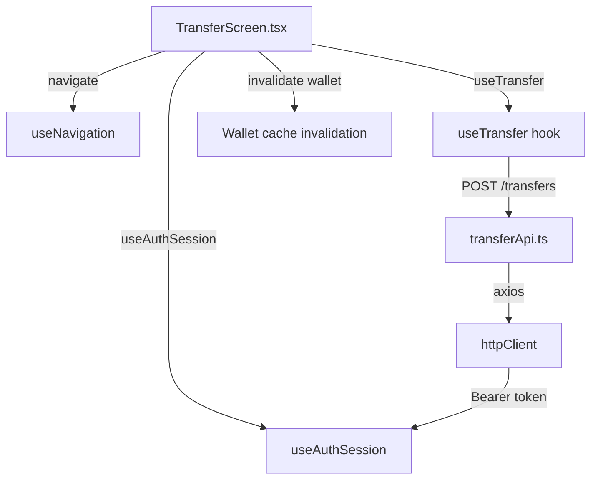
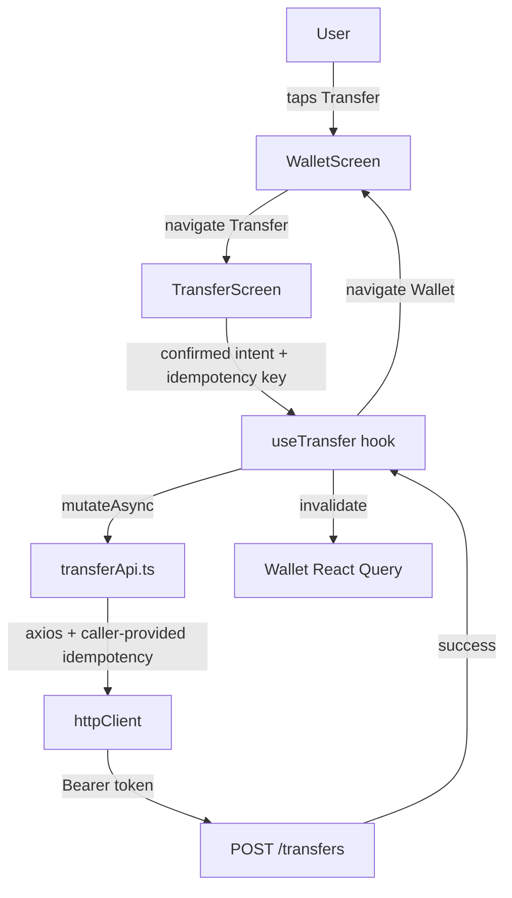

# Transfer Feature - Mobile Plan

## Overview

Implement the Transfer Flow on mobile: a multi-screen UI where users enter a recipient username, specify an amount, confirm the transfer, and see success/error states. Screens follow the established wallet screen pattern with theme-based styling, hook-based state management, and React Query caching.

## Files Analyzed

### Mobile Transfer Module Structure

**Current state:**
- `mobile/src/modules/transfers/` directory exists but is empty (only `.gitkeep`)
- Transfer placeholder route exists in RootNavigator (line 34-36, RootNavigator.tsx)

### Shared UI Components

1. **`mobile/src/shared/ui/Screen.tsx`** (24 lines)
   - Purpose: Root layout wrapper for screens
   - Features: `centered` prop, `keyboardAware` prop, `contentStyle` for custom flex layouts
   - Used in: LoginScreen, RegisterScreen, WalletScreen

2. **`mobile/src/shared/ui/TextField.tsx`** (31 lines)
   - Purpose: Reusable text input component
   - Props: placeholder, value, onChangeText, secureTextEntry, editable, etc.
   - Pattern: Controlled component with onChangeText callback

3. **`mobile/src/shared/ui/AppButton.tsx`** (133 lines)
   - Purpose: Reusable button component
   - Variants: primary, secondary, danger
   - Props: title, onPress, variant, disabled, loading, style
   - Features: loading spinner, press state, disabled state
   - Used in: all screens

4. **`mobile/src/shared/ui/AppText.tsx`** (varies)
   - Purpose: Reusable text component with variants
   - Variants: title, body, subtitle, muted, error, small
   - Styling: theme-based colors and sizes

5. **`mobile/src/shared/ui/theme.ts`** (35 lines)
   - Purpose: Central theme object with colors, spacing, radius, typography
   - Usage: Imported as `theme` and used with `StyleSheet.create()`
   - Pattern: `StyleSheet.create()` with `theme.spacing.*`, `theme.colors.*`, `theme.radius.*`

### Auth Module Patterns

6. **`mobile/src/modules/auth/screens/LoginScreen.tsx`** (47 lines)
   - Purpose: Login UI
   - Pattern: useState for inputs, hook for async logic, StyleSheet for styling
   - Structure: Screen wrapper, input fields, error display, buttons
   - State: username, password, isLoading, error
   - Imports: from shared/ui, hooks

7. **`mobile/src/modules/auth/hooks/useLogin.ts`** (29 lines)
   - Purpose: Login business logic hook
   - Pattern: useState for isLoading/error, async function `submit()`, error handling
   - Error mapping: AuthApiError codes → user-friendly messages
   - Returns: { submit, isLoading, error }

8. **`mobile/src/modules/auth/api/authApi.ts`** (44 lines)
   - Purpose: Backend API calls
   - Pattern: async function that calls httpClient, error handling with extractApiError
   - Error class: AuthApiError with code property
   - Returns: typed response objects

### Wallet Module Patterns

9. **`mobile/src/modules/wallet/screens/WalletScreen.tsx`** (104 lines)
   - Purpose: Wallet display screen
   - Pattern: useNavigation for routing, hooks for data, loading/success/error states
   - Structure: Screen wrapper, balance card, action buttons
   - Styling: StyleSheet with theme

10. **`mobile/src/modules/wallet/hooks/useWallet.ts`** (23 lines)
    - Purpose: Fetch and cache wallet data with React Query
    - Pattern: useQuery, error message mapping, returns { wallet, isLoading, error, refetch }
    - Caching: staleTime: 0 for immediate refetch

11. **`mobile/src/modules/wallet/api/walletApi.ts`** (24 lines)
    - Purpose: Wallet API calls
    - Pattern: httpClient.get, error extraction, typed response
    - Error class: WalletApiError with code property

### Navigation

12. **`mobile/src/app/navigation/types.ts`** (9 lines)
    - Purpose: Type-safe navigation parameter definitions
    - Current: `ProtectedStackParamList` with Home → Wallet, Transfer

13. **`mobile/src/app/navigation/RootNavigator.tsx`** (58 lines)
    - Purpose: Navigation setup
    - Structure: PublicNavigator, ProtectedNavigator with stacks
    - Wallet route: line 33, Transfer route: line 34-36 (placeholder)

### HTTP Client & Auth

14. **`mobile/src/shared/api/httpClient.ts`** (41 lines)
    - Purpose: Axios instance with Bearer token injection
    - Features: Automatic 401 handling, interceptors
    - Used by: all API modules

15. **`mobile/src/modules/auth/hooks/useAuthSession.ts`**
    - Purpose: Auth session provider access
    - Exports: { user, logout, accessToken, isRestoringSession, login }
    - Used by: screens for user context and logout

## Current State Analysis

### Navigation Setup (RootNavigator.tsx, lines 30-39)

```typescript
function ProtectedNavigator() {
  return (
    <ProtectedStack.Navigator>
      <ProtectedStack.Screen name="Wallet" component={WalletScreen} />
      <ProtectedStack.Screen name="Transfer">
        {() => <PlaceholderScreen name="Transfer" />}
      </ProtectedStack.Screen>
    </ProtectedStack.Navigator>
  )
}
```

**Current state:** Transfer route shows a placeholder screen. Needs real implementation.

### Navigation Types (types.ts, lines 6-9)

```typescript
export type ProtectedStackParamList = {
  Wallet: undefined
  Transfer: undefined
}
```

**Current state:** Transfer route takes no params. May need to accept optional params for future NFC integration, but MVP doesn't require it.

### Styling Pattern (WalletScreen.tsx, lines 305-325)

```typescript
const styles = StyleSheet.create({
  content: { flex: 1, justifyContent: 'space-between' },
  header: { alignItems: 'center', paddingTop: theme.spacing.xl, marginBottom: theme.spacing.xxl },
  appTitle: { marginBottom: theme.spacing.sm },
  // ...
})
```

**Pattern:** StyleSheet.create() with theme object for all spacing, colors, sizes. Used in all screens.

## Dependency Analysis



## Proposed Changes

### Files to Create

#### 1. `mobile/src/modules/transfers/types.ts` (~30 lines)

```typescript
export interface Transfer {
  id: string
  source_wallet_id: string
  destination_wallet_id: string
  amount: number
  currency: string
  origin: string
  status: string
  created_at: string
}

export interface TransferResponse {
  transfer: Transfer
}

export interface TransferRequest {
  destination_username: string
  amount: number
  origin: string
  idempotencyKey: string
}
```

**Rationale:** Type contracts for transfer API communication and state management.

---

#### 2. `mobile/src/modules/transfers/api/transferApi.ts` (~50 lines)

```typescript
import { ApiError } from '../../../shared/api/apiError'
import { httpClient } from '../../../shared/api/httpClient'
import type { Transfer, TransferResponse, TransferRequest } from '../types'

export class TransferApiError extends Error {
  constructor(public readonly code: string, message: string) {
    super(message)
    this.name = 'TransferApiError'
  }
}

function extractApiError(error: unknown): never {
  if (error instanceof ApiError && error.code) {
    throw new TransferApiError(error.code, error.message)
  }
  throw error
}

export async function createTransfer(request: TransferRequest): Promise<Transfer> {
  try {
    const { data } = await httpClient.post<TransferResponse>(
      '/transfers',
      {
        destination_username: request.destination_username,
        amount: request.amount,
        origin: request.origin,
      },
      {
        headers: {
          'Idempotency-Key': request.idempotencyKey,
        },
      }
    )
    return data.transfer
  } catch (error) {
    extractApiError(error)
  }
}
```

**Rationale:** 
- Follows walletApi pattern
- Receives an Idempotency-Key from the transfer attempt so retries of the same confirmed intent reuse the same key
- Handles error mapping to user-friendly codes
- Abstraction prevents screens from knowing HTTP details
- Does not add a `uuid` dependency; key generation stays in the screen with platform-supported primitives

**Integration:**
- Uses httpClient (shared/api/httpClient.ts)
- Called by useTransfer hook
- Errors mapped in hook to user-friendly messages

---

#### 3. `mobile/src/modules/transfers/hooks/useTransfer.ts` (~60 lines)

```typescript
import { useState } from 'react'
import { useMutation, useQueryClient } from '@tanstack/react-query'
import { createTransfer, TransferApiError } from '../api/transferApi'
import type { Transfer } from '../types'

interface TransferInput {
  destinationUsername: string
  amount: number
  idempotencyKey: string
}

function mapTransferError(error: unknown): string {
  if (error instanceof TransferApiError) {
    switch (error.code) {
      case 'destination_user_not_found':
        return 'Usuario no encontrado'
      case 'destination_wallet_not_found':
        return 'El destinatario no tiene una billetera disponible'
      case 'insufficient_balance':
        return 'Saldo insuficiente'
      case 'same_wallet_transfer':
        return 'No puedes transferir a tu propia billetera'
      case 'invalid_amount':
        return 'Cantidad inválida'
      case 'idempotency_key_conflict':
        return 'Esta transferencia ya no se puede reintentar. Revísala e intenta de nuevo.'
      default:
        return 'Error al procesar la transferencia'
    }
  }

  return 'Error de conexión. Intenta de nuevo.'
}

export function useTransfer() {
  const queryClient = useQueryClient()
  const [errorMessage, setErrorMessage] = useState<string | null>(null)

  const mutation = useMutation({
    mutationFn: (input: TransferInput) =>
      createTransfer({
        destination_username: input.destinationUsername,
        amount: input.amount,
        origin: 'manual_transfer',
        idempotencyKey: input.idempotencyKey,
      }),
    onSuccess: () => {
      // Invalidate wallet cache so balance refreshes when user returns to wallet screen
      queryClient.invalidateQueries({ queryKey: ['wallet'] })
      setErrorMessage(null)
    },
    onError: (error) => {
      setErrorMessage(mapTransferError(error))
    },
  })

  return {
    transfer: mutation.data,
    isLoading: mutation.isPending,
    error: errorMessage,
    submit: mutation.mutateAsync,
  }
}
```

**Rationale:**
- Uses React Query mutation for async logic
- Invalidates wallet cache on success (balance will be stale)
- Error mapping: backend codes → Spanish user messages
- Returns an async `submit` so the screen only shows success after backend confirmation
- Follows useLogin/useWallet pattern

---

#### 4. `mobile/src/modules/transfers/screens/TransferScreen.tsx` (~230 lines)

```typescript
import React, { useState } from 'react'
import { ActivityIndicator, StyleSheet, View } from 'react-native'
import { useNavigation } from '@react-navigation/native'
import type { NativeStackNavigationProp } from '@react-navigation/native-stack'
import type { ProtectedStackParamList } from '../../../app/navigation/types'
import { AppButton, AppText, TextField, Screen, theme } from '../../../shared/ui'
import { useTransfer } from '../hooks/useTransfer'
import type { Transfer } from '../types'

type Nav = NativeStackNavigationProp<ProtectedStackParamList, 'Transfer'>

type TransferStep = 'recipient' | 'amount' | 'confirm' | 'success' | 'error'

function createIdempotencyKey(): string {
  if (globalThis.crypto?.randomUUID) {
    return globalThis.crypto.randomUUID()
  }

  return `transfer_${Date.now()}_${Math.random().toString(36).slice(2)}`
}

function formatAmount(amount: number): string {
  return amount.toLocaleString('es-CO')
}

function parseAmount(value: string): number | null {
  const normalized = value.trim()
  if (!/^[1-9]\d*$/.test(normalized)) return null

  const amount = Number(normalized)
  if (!Number.isSafeInteger(amount)) return null

  return amount
}

export function TransferScreen() {
  const navigation = useNavigation<Nav>()
  const { isLoading, error, submit } = useTransfer()

  // UI flow state
  const [step, setStep] = useState<TransferStep>('recipient')
  const [recipient, setRecipient] = useState('')
  const [amount, setAmount] = useState('')
  const [amountError, setAmountError] = useState<string | null>(null)
  const [idempotencyKey, setIdempotencyKey] = useState(() => createIdempotencyKey())
  const [confirmedTransfer, setConfirmedTransfer] = useState<Transfer | null>(null)

  if (step === 'success' && confirmedTransfer) {
    return (
      <Screen centered>
        <AppText variant="title" style={styles.successTitle}>
          Transferencia exitosa
        </AppText>
        <View style={styles.successDetails}>
          <AppText style={styles.label}>Destinatario</AppText>
          <AppText variant="subtitle" style={styles.value}>
            {recipient}
          </AppText>
          <AppText style={styles.label}>Monto</AppText>
          <AppText variant="subtitle" style={styles.value}>
            COP {formatAmount(confirmedTransfer.amount)}
          </AppText>
          <AppText style={styles.label}>ID Operación</AppText>
          <AppText style={styles.operationId}>
            {confirmedTransfer.id.slice(0, 20)}...
          </AppText>
        </View>
        <AppButton
          title="Volver a mi billetera"
          onPress={() => navigation.navigate('Wallet')}
          style={styles.actionButton}
        />
      </Screen>
    )
  }

  if (step === 'error') {
    return (
      <Screen centered>
        <AppText variant="error" style={styles.errorTitle}>
          Error en la transferencia
        </AppText>
        <AppText variant="body" style={styles.errorMessage}>
          {error}
        </AppText>
        <AppButton
          title="Reintentar"
          onPress={async () => {
            const numAmount = parseAmount(amount)
            if (numAmount === null) {
              setStep('amount')
              return
            }

            try {
              const result = await submit({
                destinationUsername: recipient.trim(),
                amount: numAmount,
                idempotencyKey,
              })
              setConfirmedTransfer(result)
              setStep('success')
            } catch {
              setStep('error')
            }
          }}
          disabled={isLoading}
          loading={isLoading}
          style={styles.actionButton}
        />
        <AppButton
          title="Editar datos"
          variant="secondary"
          onPress={() => {
            setStep('recipient')
            setAmountError(null)
            setIdempotencyKey(createIdempotencyKey())
            setConfirmedTransfer(null)
          }}
        />
        <AppButton
          title="Cancelar"
          variant="secondary"
          onPress={() => {
            setIdempotencyKey(createIdempotencyKey())
            setConfirmedTransfer(null)
            navigation.navigate('Wallet')
          }}
        />
      </Screen>
    )
  }

  if (isLoading) {
    return (
      <Screen centered>
        <ActivityIndicator />
        <AppText variant="body" style={styles.loadingText}>
          Procesando transferencia...
        </AppText>
      </Screen>
    )
  }

  if (step === 'recipient') {
    return (
      <Screen centered keyboardAware>
        <AppText variant="title" style={styles.stepTitle}>
          ¿A quién deseas transferir?
        </AppText>
        <TextField
          placeholder="Nombre de usuario del destinatario"
          autoCapitalize="none"
          value={recipient}
          onChangeText={setRecipient}
          editable={!isLoading}
        />
        <AppButton
          title="Siguiente"
          onPress={() => {
            const normalizedRecipient = recipient.trim()
            if (!normalizedRecipient) {
              return
            }
            setRecipient(normalizedRecipient)
            setStep('amount')
          }}
          disabled={!recipient.trim()}
          style={styles.actionButton}
        />
        <AppButton
          title="Cancelar"
          variant="secondary"
          onPress={() => {
            setIdempotencyKey(createIdempotencyKey())
            setConfirmedTransfer(null)
            navigation.navigate('Wallet')
          }}
        />
      </Screen>
    )
  }

  if (step === 'amount') {
    return (
      <Screen centered keyboardAware>
        <AppText variant="title" style={styles.stepTitle}>
          ¿Cuánto deseas transferir?
        </AppText>
        <TextField
          placeholder="Cantidad en COP"
          keyboardType="number-pad"
          value={amount}
          onChangeText={(text) => {
            setAmount(text)
            setAmountError(null)
          }}
          editable={!isLoading}
        />
        {amountError && (
          <AppText variant="error" style={styles.amountErrorText}>
            {amountError}
          </AppText>
        )}
        <AppButton
          title="Siguiente"
          onPress={() => {
            const parsedAmount = parseAmount(amount)
            if (parsedAmount === null) {
              setAmountError('Ingresa una cantidad válida mayor a 0')
              return
            }
            setAmount(String(parsedAmount))
            setIdempotencyKey(createIdempotencyKey())
            setStep('confirm')
          }}
          disabled={!amount.trim()}
          style={styles.actionButton}
        />
        <AppButton
          title="Atrás"
          variant="secondary"
          onPress={() => setStep('recipient')}
        />
      </Screen>
    )
  }

  if (step === 'confirm') {
    const numAmount = parseAmount(amount)
    if (numAmount === null) {
      return (
        <Screen centered>
          <AppText variant="error" style={styles.errorMessage}>
            Ingresa una cantidad válida mayor a 0
          </AppText>
          <AppButton title="Volver al monto" onPress={() => setStep('amount')} />
        </Screen>
      )
    }

    return (
      <Screen centered contentStyle={styles.confirmContent}>
        <View>
          <AppText variant="title" style={styles.confirmTitle}>
            Confirma tu transferencia
          </AppText>
          <View style={styles.confirmCard}>
            <AppText style={styles.label}>Destinatario</AppText>
            <AppText variant="subtitle" style={styles.value}>
              {recipient}
            </AppText>
            <AppText style={styles.label}>Monto</AppText>
            <AppText variant="subtitle" style={styles.value}>
              COP {formatAmount(numAmount)}
            </AppText>
            <AppText style={styles.warning}>
              Esta acción no se puede deshacer
            </AppText>
          </View>
        </View>

        <View style={styles.actions}>
          <AppButton
            title="Transferir"
            onPress={async () => {
              try {
                const result = await submit({
                  destinationUsername: recipient.trim(),
                  amount: numAmount,
                  idempotencyKey,
                })
                setConfirmedTransfer(result)
                setStep('success')
              } catch {
                setStep('error')
              }
            }}
            disabled={isLoading}
            loading={isLoading}
            style={styles.confirmButton}
          />
          <AppButton
            title="Atrás"
            variant="secondary"
            onPress={() => {
              setIdempotencyKey(createIdempotencyKey())
              setStep('amount')
            }}
            disabled={isLoading}
          />
        </View>
      </Screen>
    )
  }

  return null
}

const styles = StyleSheet.create({
  stepTitle: {
    marginBottom: theme.spacing.xxl,
    textAlign: 'center',
  },
  actionButton: {
    marginVertical: theme.spacing.md,
  },
  amountErrorText: {
    marginTop: theme.spacing.sm,
    marginBottom: theme.spacing.md,
    textAlign: 'center',
  },
  confirmTitle: {
    marginBottom: theme.spacing.xl,
    textAlign: 'center',
  },
  confirmContent: {
    flex: 1,
    justifyContent: 'space-between',
  },
  confirmCard: {
    backgroundColor: theme.colors.surface,
    borderWidth: 1,
    borderColor: theme.colors.border,
    borderRadius: theme.radius.lg,
    padding: theme.spacing.xl,
    marginBottom: theme.spacing.xxl,
    alignItems: 'center',
  },
  label: {
    fontSize: theme.typography.small,
    color: theme.colors.mutedText,
    marginBottom: theme.spacing.xs,
  },
  value: {
    marginBottom: theme.spacing.md,
  },
  warning: {
    fontSize: theme.typography.small,
    color: theme.colors.danger,
    marginTop: theme.spacing.md,
    fontWeight: '600',
  },
  actions: {
    gap: theme.spacing.sm,
  },
  confirmButton: {
    marginBottom: theme.spacing.md,
  },
  successTitle: {
    marginBottom: theme.spacing.xxl,
    textAlign: 'center',
    color: theme.colors.success,
  },
  successDetails: {
    backgroundColor: theme.colors.surface,
    borderWidth: 1,
    borderColor: theme.colors.border,
    borderRadius: theme.radius.lg,
    padding: theme.spacing.xl,
    marginBottom: theme.spacing.xxl,
    width: '100%',
  },
  operationId: {
    fontSize: theme.typography.small,
    color: theme.colors.mutedText,
    fontFamily: 'monospace',
  },
  errorTitle: {
    marginBottom: theme.spacing.lg,
    textAlign: 'center',
  },
  errorMessage: {
    marginBottom: theme.spacing.xl,
    textAlign: 'center',
    color: theme.colors.danger,
  },
  loadingText: {
    marginTop: theme.spacing.lg,
    textAlign: 'center',
  },
})
```

**Rationale:**
- Multi-step flow: recipient → amount → confirm → success/error
- Validates input at each step and parses amount as a positive safe integer, not with permissive `parseInt`
- Shows loading spinner during API call
- Success screen appears only after backend confirmation and renders from the returned transfer stored in screen-local state
- Error screen appears from actual mutation failures and allows retry with the same idempotency key for the same confirmed intent
- Theme-based styling consistent with wallet screen
- Invalidates wallet cache on success so balance updates

---

#### 5. `mobile/src/modules/transfers/index.ts` (~5 lines)

```typescript
export { TransferScreen } from './screens/TransferScreen'
export { useTransfer } from './hooks/useTransfer'
export type { Transfer, TransferRequest } from './types'
```

**Rationale:** Module barrel export for clean imports.

---

### Files to Modify

#### 1. `mobile/src/app/navigation/RootNavigator.tsx`

**Lines 1-8 (Current imports):**
```typescript
import { NavigationContainer } from '@react-navigation/native'
import { createNativeStackNavigator } from '@react-navigation/native-stack'
import { ActivityIndicator, Text, View } from 'react-native'
import { HomeScreen } from '../screens/HomeScreen'
import { LoginScreen } from '../../modules/auth/screens/LoginScreen'
import { RegisterScreen } from '../../modules/auth/screens/RegisterScreen'
import { useAuthSession } from '../../modules/auth/hooks/useAuthSession'
import type { ProtectedStackParamList, PublicStackParamList } from './types'
```

**Lines 1-9 (Proposed):**
```typescript
import { NavigationContainer } from '@react-navigation/native'
import { createNativeStackNavigator } from '@react-navigation/native-stack'
import { ActivityIndicator, Text, View } from 'react-native'
import { LoginScreen } from '../../modules/auth/screens/LoginScreen'
import { RegisterScreen } from '../../modules/auth/screens/RegisterScreen'
import { TransferScreen } from '../../modules/transfers/screens/TransferScreen'
import { useAuthSession } from '../../modules/auth/hooks/useAuthSession'
import { WalletScreen } from '../../modules/wallet/screens/WalletScreen'
import type { ProtectedStackParamList, PublicStackParamList } from './types'
```

**Changes:**
- Add: `import { TransferScreen } from '../../modules/transfers/screens/TransferScreen'`
- Add: `import { WalletScreen } from '../../modules/wallet/screens/WalletScreen'` (for consistency)
- Remove: old HomeScreen import

---

**Lines 33-36 (Current ProtectedNavigator):**
```typescript
function ProtectedNavigator() {
  return (
    <ProtectedStack.Navigator>
      <ProtectedStack.Screen name="Wallet" component={WalletScreen} />
      <ProtectedStack.Screen name="Transfer">
        {() => <PlaceholderScreen name="Transfer" />}
      </ProtectedStack.Screen>
    </ProtectedStack.Navigator>
  )
}
```

**Lines 33-36 (Proposed):**
```typescript
function ProtectedNavigator() {
  return (
    <ProtectedStack.Navigator screenOptions={{ headerShown: false }}>
      <ProtectedStack.Screen name="Wallet" component={WalletScreen} />
      <ProtectedStack.Screen name="Transfer" component={TransferScreen} />
    </ProtectedStack.Navigator>
  )
}
```

**Changes:**
- Replace Transfer placeholder with actual TransferScreen component
- Add headerShown: false (consistent with PublicNavigator style)
- Remove PlaceholderScreen

**Rationale:**
- Removes placeholder, wires up real Transfer component
- Ensures nav headers are hidden like public navigator

---

#### 2. `mobile/src/modules/wallet/screens/WalletScreen.tsx`

**No code changes needed** — the Transfer button already navigates to 'Transfer' route correctly (line 296: `navigation.navigate('Transfer')`).

Verification: this button will now navigate to the real TransferScreen instead of placeholder.

---

### Files NOT to Create

- No separate recipient resolution component (handled in TransferScreen)
- No context/providers (use React Query + httpClient)
- No Redux/Zustand stores (useState + useMutation is sufficient)
- No intermediate screens (recipient, amount, confirm all in one component with state machine)
- No separate validation library (simple inline validation)
- No new UUID/random dependency unless TypeScript/runtime verification proves `globalThis.crypto.randomUUID()` is unavailable

## Implementation Steps

### Step 1: Create transfer module types

Create `mobile/src/modules/transfers/types.ts` with Transfer, TransferResponse, TransferRequest interfaces.

**Files affected:**
- `mobile/src/modules/transfers/types.ts` (new)

**Verification:**
```bash
npx tsc --noEmit
```

---

### Step 2: Create transfer API client

Create `mobile/src/modules/transfers/api/transferApi.ts` with `createTransfer()` function and error handling. The API client receives `idempotencyKey` from the caller and sends it as `Idempotency-Key`; it must not create a new key per HTTP call.

**Files affected:**
- `mobile/src/modules/transfers/api/transferApi.ts` (new)

**Verification:**
```bash
npx tsc --noEmit
grep -n "createTransfer" mobile/src/modules/transfers/api/transferApi.ts
```

---

### Step 3: Create useTransfer hook

Create `mobile/src/modules/transfers/hooks/useTransfer.ts` with React Query mutation and error mapping. Return `mutation.mutateAsync` as `submit` so screens can transition to success or error only after the backend response resolves.

**Files affected:**
- `mobile/src/modules/transfers/hooks/useTransfer.ts` (new)

**Verification:**
```bash
npx tsc --noEmit
grep -n "useTransfer" mobile/src/modules/transfers/hooks/useTransfer.ts
```

---

### Step 4: Create TransferScreen component

Create `mobile/src/modules/transfers/screens/TransferScreen.tsx` with multi-step UI flow. Generate one idempotency key per confirmed transfer attempt, reuse it for retries of the same recipient/amount after network or server ambiguity, and generate a new key only when the user edits recipient/amount, cancels, or starts a new transfer.

**Files affected:**
- `mobile/src/modules/transfers/screens/TransferScreen.tsx` (new)

**Verification:**
```bash
npx tsc --noEmit
grep -n "export function TransferScreen" mobile/src/modules/transfers/screens/TransferScreen.tsx
```

---

### Step 5: Create module barrel export

Create `mobile/src/modules/transfers/index.ts` for clean imports.

**Files affected:**
- `mobile/src/modules/transfers/index.ts` (new)

**Verification:**
```bash
ls -la mobile/src/modules/transfers/
```

---

### Step 6: Update RootNavigator imports

Modify `mobile/src/app/navigation/RootNavigator.tsx` to import TransferScreen and replace placeholder.

**Files affected:**
- `mobile/src/app/navigation/RootNavigator.tsx` lines 1-9, 33-36

**Verification:**
```bash
npx tsc --noEmit
grep -n "import.*TransferScreen\|component={TransferScreen}" mobile/src/app/navigation/RootNavigator.tsx
```

---

### Step 7: Add focused transfer tests

Create only the focused tests needed to protect the money-movement client risks introduced by this screen.

**Files affected:**
- `mobile/src/modules/transfers/screens/TransferScreen.test.tsx` (new)
- `mobile/src/modules/transfers/api/transferApi.test.ts` (new)

**Verification:**
```bash
cd mobile && npm test -- --runInBand
```

---

### Step 8: Run TypeScript compilation and tests

Verify no type errors and all existing tests pass.

**Verification:**
```bash
cd mobile && npx tsc --noEmit
cd mobile && npm test
```

---

### Step 9: Manual testing on device/emulator

1. Login to an account
2. Navigate to WalletScreen
3. Press "Transfer" button
4. Enter recipient username
5. Enter amount
6. Confirm transfer
7. See success screen
8. Navigate back to wallet (verify balance has updated)

## Architecture Diagram



## Scope Boundaries

### What WILL be implemented:

- TransferScreen: recipient username input, amount input, confirmation, success/error states (screens/TransferScreen.tsx)
- useTransfer hook with React Query mutation (hooks/useTransfer.ts)
- transferApi.ts with createTransfer() function (api/transferApi.ts)
- Client-side idempotency key generation per confirmed transfer attempt, owned by TransferScreen state
- Idempotency key reuse for retrying the same confirmed recipient/amount after a failed or ambiguous response
- Error message mapping: backend codes → Spanish UI messages (useTransfer.ts)
- Wallet cache invalidation on success (useTransfer.ts `onSuccess`)
- Multi-step UI state machine within single screen (useState step variable)
- Strict amount parsing as positive safe integer COP; no floating-point or permissive `parseInt`
- Recipient normalization with `trim()` before confirmation and submit
- Theme-consistent styling with AppButton, AppText, TextField
- Loading spinner during API call
- Success screen with transfer details and navigation back to wallet
- Error screen with retry option

### What will NOT be implemented:

- NFC integration (future phase)
- Transaction history view in transfer flow
- Amount validation against wallet balance (backend does this)
- Recipient search/autocomplete (just username input)
- QR code generation/scanning
- Multiple transfers in one session (each transfer navigates back to wallet)
- Offline support/queue
- Animation transitions between steps
- Haptic feedback
- Transaction details endpoint (not needed for MVP)

### Assumptions:

- Backend `POST /transfers` accepts `destination_username` (see backend plan)
- HttpClient Bearer token injection is working (verified in wallet implementation)
- React Query is configured in AppProviders.tsx (confirmed)
- useNavigation<Nav>() pattern matches react-navigation version in use
- Runtime supports `globalThis.crypto.randomUUID()` or the fallback key format is accepted by backend idempotency storage

## Testing Strategy

### Focused Automated Tests

1. **`TransferScreen.test.tsx`** (~70 lines)
   - Test: invalid amount does not submit.
   - Test: success is not shown until `submit` resolves.
   - Test: retry from error reuses the same idempotency key for the same confirmed recipient/amount.

2. **`transferApi.test.ts`** (~40 lines)
   - Mock httpClient
   - Test: caller-provided idempotency key header is set
   - Test: API does not generate or replace the idempotency key
   - Coverage: API request shape

### Manual Testing

1. **Happy Path:**
   ```
   Login → Wallet Screen → Press Transfer
   Enter username: [valid user]
   Enter amount: [valid amount < balance]
   Confirm → See success screen with transfer ID
   Navigate back → Balance updated
   ```

2. **Error Cases:**
   ```
   Enter non-existent username → Error message
   Enter amount > balance → Error message from backend
   Enter 0 or negative amount → Error message
   Enter decimal/alphanumeric amount → Error message before submit
   Transfer to self → Error message from backend
   Network error → Generic error message + retry button
   ```

3. **Recovery:**
   ```
   Failed/ambiguous transfer → Press "Reintentar"
   Sends the same recipient/amount with the same Idempotency-Key
   Press "Editar datos" → returns to recipient step and creates a new Idempotency-Key
   ```

## Rollback Plan

If issues arise:

1. **Revert PR:** `git revert <commit-hash>`
2. **RootNavigator reverts to placeholder:** Transfer route shows placeholder again
3. **No schema changes:** No migrations or database impacts
4. **Verify navigation still works:** Manual test Wallet → Transfer placeholder

## Success Criteria

- [ ] TransferScreen component renders all three steps
- [ ] Recipient step validates username is not empty
- [ ] Recipient is trimmed before confirmation and submit
- [ ] Amount step validates amount is a positive safe integer COP value
- [ ] Confirm step shows recipient and amount clearly
- [ ] Submit sends POST /transfers with destination_username and idempotency key
- [ ] The idempotency key is stable while retrying the same confirmed transfer attempt
- [ ] Editing recipient or amount creates a new idempotency key
- [ ] Success screen is shown only after the backend confirms the transfer
- [ ] API failure transitions to the error screen
- [ ] Success screen shows transfer ID and details
- [ ] Error screen shows user-friendly Spanish error messages
- [ ] Backend error codes map correctly: destination_user_not_found, destination_wallet_not_found, insufficient_balance, invalid_amount, same_wallet_transfer, idempotency_key_conflict
- [ ] Wallet cache invalidates on success (balance updates when returning to wallet)
- [ ] Navigation back to Wallet screen works from success and error states
- [ ] TypeScript compiles with no errors
- [ ] All existing tests pass

## TL;DR

| Aspect | Detail |
|--------|--------|
| **Files to create** | 7 (types.ts, transferApi.ts, useTransfer.ts, TransferScreen.tsx, index.ts, TransferScreen.test.tsx, transferApi.test.ts) |
| **Files to modify** | 1 (RootNavigator.tsx) |
| **Total lines added** | ~550 (screen 230 + hook 70 + api 45 + types 30 + index 5 + nav updates 25 + focused tests 145) |
| **Total lines removed** | ~3 (placeholder import/render in RootNavigator) |
| **Key deliverables** | Multi-step transfer screen, API client, React Query hook, error handling, success/error states |
| **What will NOT be included** | NFC, recipient search, offline support, animations, history view |

## Team TL;DR

**What we're building:** A transfer screen where users enter a recipient username, specify an amount, and confirm — then see success or error feedback. It's a complete flow from wallet screen to completion.

**Why it matters:** This is the core feature: letting users move money. The UX is simple and clear: three steps, immediate feedback, one action at a time.

**Timeline impact:** Standalone feature, doesn't block other work. Backend change (username resolution) is small and backwards compatible. Mobile screens ready immediately after backend is live.
