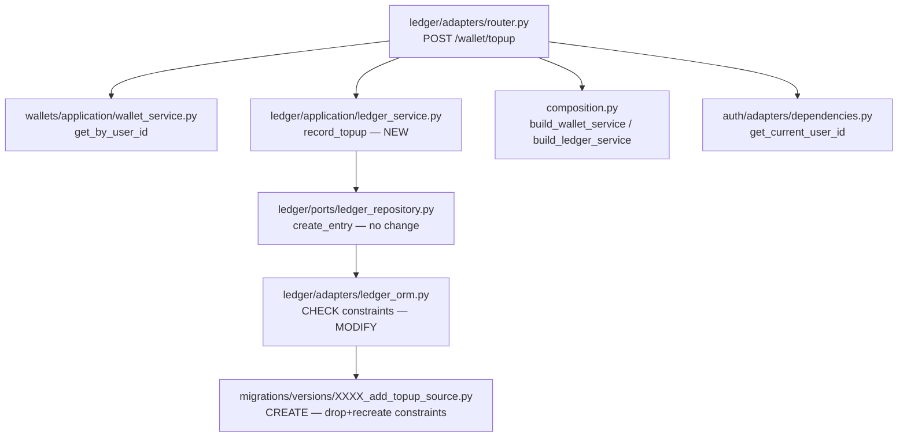

# Top-Up Feature — Backend Plan

## Overview

Add a `POST /wallet/topup` endpoint that credits simulated balance to the authenticated user's wallet. There is no counterparty or transfer operation: it is a unilateral credit recorded in the ledger with `source='topup'`.

---

## Files Analyzed

### Core files

1. `backend/src/flowpay/ledger/adapters/ledger_orm.py` (53 lines)
   - Defines the `LedgerTransaction` ORM model and all the table's CHECK constraints.
   - **Critical Problem**: constraints hardcode the allowed `source` values — `topup` will break the DB if not migrated first.
   - Affected constraints: `ck_ledger_transactions_source`, `ck_ledger_transactions_type_source`, `ck_ledger_transactions_operation_reference`.

2. `backend/src/flowpay/ledger/application/ledger_service.py` (91 lines)
   - Contains `record_welcome_bonus()` (lines 16-39): exact pattern to copy for `record_topup()`.
   - `WELCOME_BONUS_AMOUNT = 50_000` constant (line 7): does not apply for top-up (variable amount).

3. `backend/src/flowpay/ledger/adapters/router.py` (97 lines)
   - Has `GET /wallet` and `GET /wallet/transactions`.
   - The new `POST /wallet/topup` endpoint goes in this same router — same module, same auth dependency.

4. `backend/src/flowpay/ledger/ports/ledger_repository.py` (64 lines)
   - `LedgerRepository` protocol — comment on line 13 lists valid `source` values.
   - `create_entry()` already accepts the necessary parameters for top-up without interface changes.

5. `backend/migrations/versions/c87dd4f707cd_create_ledger_transactions_table.py` (52 lines)
   - Original table migration — defines the constraints to be modified.
   - The `down_revision` of the new migration will point to `c87dd4f707cd`... but must point to the most recent migration.

6. `backend/src/flowpay/composition.py` (67 lines)
   - `build_ledger_service(db)` already exists (lines 46-49) — no change required.

7. `backend/src/flowpay/shared/errors.py` (9 lines)
   - `FlowPayHTTPError` — same pattern as all existing endpoints.

8. `backend/tests/integration/ledger/test_ledger_endpoints.py` (244 lines)
   - Pattern of helpers `_register_and_get()` and `_create_wallet_for_user()` to reuse in new tests.

9. `backend/tests/integration/ledger/test_ledger_service.py` (226 lines)
   - Service unit tests — copy the pattern from `test_record_welcome_bonus_with_valid_data()`.

---

## Current State Analysis

### Critical Constraint in the ORM (lines 23-48 of `ledger_orm.py`)

```python
# lines 26-27
CheckConstraint(
    "source IN ('welcome_bonus', 'manual_transfer', 'nfc_transfer')",
    name="ck_ledger_transactions_source",
),
# lines 28-35
CheckConstraint(
    "(type = 'credit' AND source IN ('welcome_bonus', 'manual_transfer', 'nfc_transfer')) "
    "OR (type = 'debit' AND source IN ('manual_transfer', 'nfc_transfer'))",
    name="ck_ledger_transactions_type_source",
),
# lines 36-39
CheckConstraint(
    "(source = 'welcome_bonus' AND operation_id IS NULL) "
    "OR (source IN ('manual_transfer', 'nfc_transfer') AND operation_id IS NOT NULL)",
    name="ck_ledger_transactions_operation_reference",
),
```

Without the migration, any INSERT with `source='topup'` will fail with `IntegrityError`. The migration is the first blocking step.

### Closest Existing Endpoint (lines 14-42 of `router.py`)

```python
@router.get("/wallet", response_model=WalletEnvelope)
def get_wallet(
    current_user_id: str = Depends(get_current_user_id),
    db: Session = Depends(get_db),
) -> WalletEnvelope:
    wallet_service = build_wallet_service(db)
    ledger_service = build_ledger_service(db)

    wallet_summary = wallet_service.get_by_user_id(current_user_id)
    if wallet_summary is None:
        raise FlowPayHTTPError(
            code="wallet_not_found",
            message="Wallet not found",
            status_code=404,
        )
```

The new `POST /wallet/topup` endpoint follows exactly this pattern.

### Closest Service Method (lines 16-39 of `ledger_service.py`)

```python
def record_welcome_bonus(self, wallet_id: str) -> TransactionSummary:
    """Record the one-time wallet welcome bonus."""
    transaction_id = generate_id("txn_")
    record = self.repository.create_entry(
        transaction_id=transaction_id,
        wallet_id=wallet_id,
        type="credit",
        amount=WELCOME_BONUS_AMOUNT,
        source="welcome_bonus",
        operation_id=None,
        counterparty_wallet_id=None,
    )
```

`record_topup()` is identical except it receives `amount` as a parameter and uses `source="topup"`.

---

## Dependency Analysis



---

## Proposed Changes

### Step 1 — Alembic Migration (new file)

**File to create:** `backend/migrations/versions/e1a2b3c4d5e6_add_topup_source_to_ledger.py`

The migration must:
1. Delete the 3 CHECK constraints that list `source` by name.
2. Recreate them with `'topup'` added.

```python
"""add topup source to ledger_transactions

Revision ID: e1a2b3c4d5e6
Revises: d2aff0e6e0ab
Branch labels: None
Depends on: None

"""

revision = 'e1a2b3c4d5e6'
down_revision = 'd2aff0e6e0ab'
branch_labels = None
depends_on = None

from alembic import op


def upgrade() -> None:
    op.drop_constraint('ck_ledger_transactions_source', 'ledger_transactions')
    op.drop_constraint('ck_ledger_transactions_type_source', 'ledger_transactions')
    op.drop_constraint('ck_ledger_transactions_operation_reference', 'ledger_transactions')

    op.create_check_constraint(
        'ck_ledger_transactions_source',
        'ledger_transactions',
        "source IN ('welcome_bonus', 'manual_transfer', 'nfc_transfer', 'topup')",
    )
    op.create_check_constraint(
        'ck_ledger_transactions_type_source',
        'ledger_transactions',
        "(type = 'credit' AND source IN ('welcome_bonus', 'manual_transfer', 'nfc_transfer', 'topup')) "
        "OR (type = 'debit' AND source IN ('manual_transfer', 'nfc_transfer'))",
    )
    op.create_check_constraint(
        'ck_ledger_transactions_operation_reference',
        'ledger_transactions',
        "(source IN ('welcome_bonus', 'topup') AND operation_id IS NULL) "
        "OR (source IN ('manual_transfer', 'nfc_transfer') AND operation_id IS NOT NULL)",
    )


def downgrade() -> None:
    op.drop_constraint('ck_ledger_transactions_source', 'ledger_transactions')
    op.drop_constraint('ck_ledger_transactions_type_source', 'ledger_transactions')
    op.drop_constraint('ck_ledger_transactions_operation_reference', 'ledger_transactions')

    op.create_check_constraint(
        'ck_ledger_transactions_source',
        'ledger_transactions',
        "source IN ('welcome_bonus', 'manual_transfer', 'nfc_transfer')",
    )
    op.create_check_constraint(
        'ck_ledger_transactions_type_source',
        'ledger_transactions',
        "(type = 'credit' AND source IN ('welcome_bonus', 'manual_transfer', 'nfc_transfer')) "
        "OR (type = 'debit' AND source IN ('manual_transfer', 'nfc_transfer'))",
    )
    op.create_check_constraint(
        'ck_ledger_transactions_operation_reference',
        'ledger_transactions',
        "(source = 'welcome_bonus' AND operation_id IS NULL) "
        "OR (source IN ('manual_transfer', 'nfc_transfer') AND operation_id IS NOT NULL)",
    )
```

> **Note on `down_revision`**: points to `d2aff0e6e0ab` (the most recent migration). Verify with `alembic heads` before implementing.

---

### Step 2 — ORM: update constraints in Python

**File to modify:** `backend/src/flowpay/ledger/adapters/ledger_orm.py`

**Lines 26-39 (current):**
```python
        CheckConstraint(
            "source IN ('welcome_bonus', 'manual_transfer', 'nfc_transfer')",
            name="ck_ledger_transactions_source",
        ),
        CheckConstraint(
            "(type = 'credit' AND source IN ('welcome_bonus', 'manual_transfer', 'nfc_transfer')) "
            "OR (type = 'debit' AND source IN ('manual_transfer', 'nfc_transfer'))",
            name="ck_ledger_transactions_type_source",
        ),
        CheckConstraint(
            "(source = 'welcome_bonus' AND operation_id IS NULL) "
            "OR (source IN ('manual_transfer', 'nfc_transfer') AND operation_id IS NOT NULL)",
            name="ck_ledger_transactions_operation_reference",
        ),
```

**Lines 26-39 (proposed):**
```python
        CheckConstraint(
            "source IN ('welcome_bonus', 'manual_transfer', 'nfc_transfer', 'topup')",
            name="ck_ledger_transactions_source",
        ),
        CheckConstraint(
            "(type = 'credit' AND source IN ('welcome_bonus', 'manual_transfer', 'nfc_transfer', 'topup')) "
            "OR (type = 'debit' AND source IN ('manual_transfer', 'nfc_transfer'))",
            name="ck_ledger_transactions_type_source",
        ),
        CheckConstraint(
            "(source IN ('welcome_bonus', 'topup') AND operation_id IS NULL) "
            "OR (source IN ('manual_transfer', 'nfc_transfer') AND operation_id IS NOT NULL)",
            name="ck_ledger_transactions_operation_reference",
        ),
```

**Changes:** 3 lines edited (constraint strings), 0 lines added, 0 lines removed.

---

### Step 3 — Port: update `source` comment

**File to modify:** `backend/src/flowpay/ledger/ports/ledger_repository.py`

**Line 13 (current):**
```python
    source: str  # 'welcome_bonus', 'manual_transfer', 'nfc_transfer'
```

**Line 13 (proposed):**
```python
    source: str  # 'welcome_bonus', 'manual_transfer', 'nfc_transfer', 'topup'
```

**Changes:** 1 line edited.

---

### Step 4 — LedgerService: add `record_topup()`

**File to modify:** `backend/src/flowpay/ledger/application/ledger_service.py`

**Insert `TOP_UP_MAX_AMOUNT = 1_000_000` at line 8** (along with `WELCOME_BONUS_AMOUNT = 50_000`, as a module constant):

```python
WELCOME_BONUS_AMOUNT = 50_000
TOP_UP_MAX_AMOUNT = 1_000_000   # line 8 — new
```

**Insert the method after line 39** (after `record_welcome_bonus`, before `record_transfer_entries`):

```python
    def record_topup(self, wallet_id: str, amount: int) -> TransactionSummary:
        """Record a simulated top-up credit for the given wallet."""
        if amount <= 0 or amount > TOP_UP_MAX_AMOUNT:
            raise ValueError(f"amount must be between 1 and {TOP_UP_MAX_AMOUNT}")

        transaction_id = generate_id("txn_")
        record = self.repository.create_entry(
            transaction_id=transaction_id,
            wallet_id=wallet_id,
            type="credit",
            amount=amount,
            source="topup",
            operation_id=None,
            counterparty_wallet_id=None,
        )
        return self._to_summary(record)
```

**Changes:** 1 line in the module constant + ~12 lines for the method.

> Validation lives in the service because it's a business rule (ADR 0001: "HTTP adapters call application use cases; they do not implement business rules"). `TOP_UP_MAX_AMOUNT` is a module constant, same as `WELCOME_BONUS_AMOUNT`.

---

### Step 5 — Router: add `POST /wallet/topup`

**File to modify:** `backend/src/flowpay/ledger/adapters/router.py`

**Insert after line 20** (along with existing Pydantic models):

```python
class TopUpRequest(BaseModel):
    amount: int


class TopUpResponse(BaseModel):
    transaction: TransactionResponse
```

**Insert after line 42** (after `get_wallet`, before `get_wallet_transactions`):

```python
@router.post("/wallet/topup", response_model=TopUpResponse, status_code=201)
def topup_wallet(
    body: TopUpRequest,
    current_user_id: str = Depends(get_current_user_id),
    db: Session = Depends(get_db),
) -> TopUpResponse:
    wallet_service = build_wallet_service(db)
    ledger_service = build_ledger_service(db)

    wallet_summary = wallet_service.get_by_user_id(current_user_id)
    if wallet_summary is None:
        raise FlowPayHTTPError(
            code="wallet_not_found",
            message="Wallet not found",
            status_code=404,
        )

    try:
        txn = ledger_service.record_topup(wallet_summary.id, body.amount)
    except ValueError as exc:
        raise FlowPayHTTPError(code="invalid_amount", message=str(exc), status_code=400)

    return TopUpResponse(
        transaction=TransactionResponse(
            id=txn.id,
            type=txn.type,
            amount=txn.amount,
            currency=txn.currency,
            source=txn.source,
            operation_id=txn.operation_id,
            counterparty=None,
            created_at=txn.created_at,
        )
    )
```

**Changes:** ~28 lines added. The router delegates validation to the service and catches `ValueError` — the router does not implement business rules (ADR 0001).

---

## Implementation Steps

### Step 1 — Migration
```bash
# Verify that down_revision is correct
cd backend && alembic heads

# Create the migration file manually with the content of the plan
# DO NOT use alembic revision --autogenerate because Python CHECK
# constraints are not detected the same as in the DB when modified

# Apply migration
alembic upgrade head
```

**Verification:**
```bash
# Connect to the DB and confirm constraints
psql $DATABASE_URL -c "\d ledger_transactions"
# It should show the 3 updated constraints with 'topup'
```

### Step 2 — Code (ORM + Port + Service + Router)
Edit the 4 files in the order listed above. There are no circular dependencies between them.

### Step 3 — Tests
```bash
cd backend
pytest tests/integration/ledger/ -v
```

---

## Testing Strategy

### Unit tests to add in `test_ledger_service.py`

Add at the end of the file (~line 226):

```python
def test_record_topup_credits_wallet(ledger_service: LedgerService, test_wallet):
    txn = ledger_service.record_topup(test_wallet.id, 100_000)

    assert txn.id.startswith("txn_")
    assert txn.wallet_id == test_wallet.id
    assert txn.type == "credit"
    assert txn.amount == 100_000
    assert txn.currency == "COP"
    assert txn.source == "topup"
    assert txn.operation_id is None
    assert txn.counterparty_wallet_id is None


def test_record_topup_can_be_called_multiple_times(ledger_service: LedgerService, test_wallet):
    ledger_service.record_topup(test_wallet.id, 50_000)
    ledger_service.record_topup(test_wallet.id, 50_000)

    balance = ledger_service.get_wallet_balance(test_wallet.id)
    assert balance.balance == 100_000


def test_record_topup_rejects_zero_amount(ledger_service: LedgerService, test_wallet):
    with pytest.raises(ValueError):
        ledger_service.record_topup(test_wallet.id, 0)


def test_record_topup_rejects_amount_above_max(ledger_service: LedgerService, test_wallet):
    with pytest.raises(ValueError):
        ledger_service.record_topup(test_wallet.id, 1_000_001)
```

### Integration tests to add in `test_ledger_endpoints.py`

```python
def test_topup_wallet_returns_201_with_transaction(client: TestClient, db: Session):
    token, wallet_id = _register_and_get(client, "topup_user")

    resp = client.post(
        "/wallet/topup",
        json={"amount": 200_000},
        headers={"Authorization": f"Bearer {token}"},
    )

    assert resp.status_code == 201
    data = resp.json()
    assert data["transaction"]["type"] == "credit"
    assert data["transaction"]["amount"] == 200_000
    assert data["transaction"]["source"] == "topup"
    assert data["transaction"]["operation_id"] is None
    assert data["transaction"]["counterparty"] is None


def test_topup_updates_wallet_balance(client: TestClient, db: Session):
    token, _ = _register_and_get(client, "topup_balance_user")

    client.post(
        "/wallet/topup",
        json={"amount": 100_000},
        headers={"Authorization": f"Bearer {token}"},
    )

    resp = client.get("/wallet", headers={"Authorization": f"Bearer {token}"})
    assert resp.json()["wallet"]["balance"] == 150_000  # 50k bonus + 100k topup


def test_topup_rejects_zero_amount(client: TestClient, db: Session):
    token, _ = _register_and_get(client, "topup_zero_user")

    resp = client.post(
        "/wallet/topup",
        json={"amount": 0},
        headers={"Authorization": f"Bearer {token}"},
    )

    assert resp.status_code == 400
    assert resp.json()["error"]["code"] == "invalid_amount"


def test_topup_rejects_amount_above_max(client: TestClient, db: Session):
    token, _ = _register_and_get(client, "topup_max_user")

    resp = client.post(
        "/wallet/topup",
        json={"amount": 1_000_001},
        headers={"Authorization": f"Bearer {token}"},
    )

    assert resp.status_code == 400
    assert resp.json()["error"]["code"] == "invalid_amount"


def test_topup_requires_authentication(client: TestClient):
    resp = client.post("/wallet/topup", json={"amount": 100_000})
    assert resp.status_code == 401


def test_topup_appears_in_transaction_history(client: TestClient, db: Session):
    token, _ = _register_and_get(client, "topup_history_user")
    client.post(
        "/wallet/topup",
        json={"amount": 75_000},
        headers={"Authorization": f"Bearer {token}"},
    )

    resp = client.get(
        "/wallet/transactions?type=credit",
        headers={"Authorization": f"Bearer {token}"},
    )

    sources = [t["source"] for t in resp.json()["transactions"]]
    assert "topup" in sources
```

---

## Scope Boundaries

### What IS implemented:
- Alembic migration to expand the 3 CHECK constraints.
- `record_topup(wallet_id, amount)` in `LedgerService`.
- `POST /wallet/topup` — authenticated, returns 201 with the transaction.
- Validation: amount between 1 and 1,000,000 COP.
- Service and endpoint tests.

### What IS NOT implemented:
- Rate limiting per user (no infrastructure for that in this stack).
- Separate audit log (the ledger is the record).
- Accumulated daily limit (outside MVP scope).
- No new composition file — `build_ledger_service` already exists.

---

## Files to Modify
| File | Type | Change |
|---|---|---|
| `backend/src/flowpay/ledger/adapters/ledger_orm.py` | Modify | 3 constraint strings (lines 27, 31-34, 36-39) |
| `backend/src/flowpay/ledger/ports/ledger_repository.py` | Modify | comment line 13 |
| `backend/src/flowpay/ledger/application/ledger_service.py` | Modify | +13 lines after line 39 |
| `backend/src/flowpay/ledger/adapters/router.py` | Modify | +30 lines after line 42 |
| `backend/tests/integration/ledger/test_ledger_service.py` | Modify | +30 lines at the end |
| `backend/tests/integration/ledger/test_ledger_endpoints.py` | Modify | +55 lines at the end |

## Files to Create
| File | Purpose |
|---|---|
| `backend/migrations/versions/e1a2b3c4d5e6_add_topup_source_to_ledger.py` | Alembic Migration — drop+recreate 3 constraints |

---

## TL;DR
- Total files to modify: 6
- Total files to create: 1
- Estimated lines: ~130 added / 0 removed / ~5 edited
- Deliverables: `POST /wallet/topup` endpoint, DB migration, service method, tests
- Does NOT include: rate limiting, daily limit, new table

## Team TL;DR
**What we're building**: Users will be able to top up their wallet directly from the app, with a maximum of COP 1,000,000 per load.

**Why it matters**: Allows testing the complete payment cycle without depending on a welcome bonus as the only source of funds.

**Timeline impact**: No new dependencies — uses existing ledger infrastructure. The only mandatory sequential step is to apply the migration before deploying the code.
