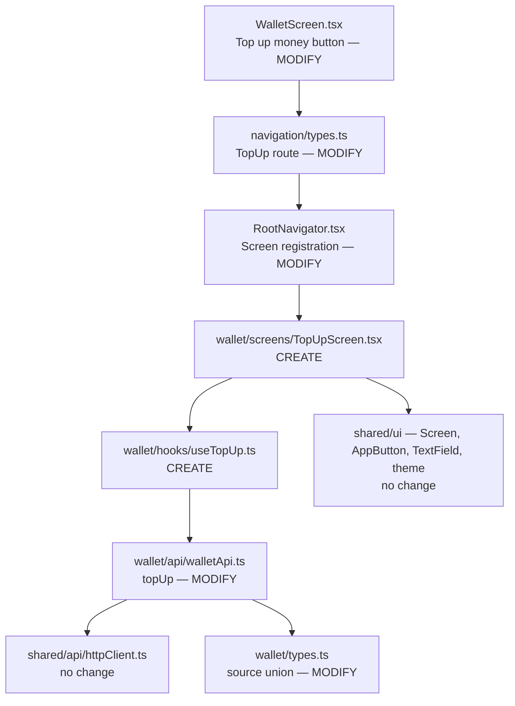

# Top-Up Feature — Mobile Plan

## Overview

Add the "Top up money" screen in the mobile app. The user enters an amount, sees a confirmation summary, and receives success or error feedback. The step pattern (amount → confirm → success/error) exactly replicates that of `TransferScreen` to maintain UX and code consistency.

---

## Files Analyzed

### Core files

1. `mobile/src/modules/wallet/screens/WalletScreen.tsx` (117 lines)
   - Has an `actions` block (lines 62-71) with two buttons: "Transfer" and "Ver historial".
   - The new "Top up money" button goes in that same block.
   - Uses `navigation.navigate('Transfer')` — top-up uses the same pattern with `'TopUp'`.

2. `mobile/src/modules/transfers/screens/TransferScreen.tsx` (471 lines)
   - Exact reference pattern for `TopUpScreen`.
   - Steps: `'recipient' | 'amount' | 'confirm' | 'success' | 'error'`.
   - For top-up: steps `'amount' | 'confirm' | 'success' | 'error'` (no recipient or NFC).
   - `parseAmount()` (lines 31-38) and `formatAmount()` (lines 27-29): copied without change.
   - Styles for `confirmCard`, `confirmContent`, `label`, `value`, `successTitle`, `errorMessage`, etc.: replicated.

3. `mobile/src/modules/transfers/hooks/useTransfer.ts` (64 lines)
   - Exact reference pattern for `useTopUp`.
   - Uses `useMutation` + `useQueryClient` + `queryClient.invalidateQueries`.
   - `mapTransferError()` (lines 13-33): the top-up hook has its own simpler `mapTopUpError()`.

4. `mobile/src/modules/transfers/api/transferApi.ts` (39 lines)
   - Reference pattern for the `topUp()` function in `walletApi.ts`.
   - `TransferApiError` → do not create a new class; use `WalletApiError` which already exists in `walletApi.ts`.

5. `mobile/src/modules/wallet/api/walletApi.ts` (48 lines)
   - Already contains `getWallet()` and `getTransactions()` — add `topUp(amount)` here.
   - `WalletApiError` is already defined (lines 5-9): reuse for top-up.
   - `extractApiError()` already exists (lines 11-16): reuse directly.

6. `mobile/src/modules/wallet/types.ts` (31 lines)
   - `Transaction.source` (line 22): `'welcome_bonus' | 'manual_transfer'` — add `'topup'`.
   - Do not add a new type for the top-up response — the endpoint returns `TransactionResponse` which is compatible with `Transaction`.

7. `mobile/src/app/navigation/types.ts` (10 lines)
   - `ProtectedStackParamList` (lines 6-10): add `TopUp: undefined`.

8. `mobile/src/app/navigation/RootNavigator.tsx` (51 lines)
   - `ProtectedNavigator` (lines 24-32): add `<ProtectedStack.Screen name="TopUp" component={TopUpScreen} />`.

9. `mobile/src/shared/ui/theme.ts` (34 lines)
   - Reference for all style constants: `theme.spacing`, `theme.colors`, `theme.radius`, `theme.typography`.
   - The new screen uses exclusively these constants — no hardcoded values.

10. `mobile/src/shared/ui/Screen.tsx` (33 lines), `AppButton.tsx` (133 lines), `TextField.tsx` (34 lines)
    - The three components that `TransferScreen` uses — `TopUpScreen` uses exactly the same ones.

---

## Current State Analysis

### Action Block in WalletScreen (lines 62-71)

```tsx
// WalletScreen.tsx lines 62-71
<View style={styles.actions}>
  <AppButton title="Transfer" onPress={() => navigation.navigate('Transfer')} />
  <AppButton
    title="Ver historial"
    variant="secondary"
    onPress={() => navigation.navigate('TransactionHistory')}
  />
</View>
```

The new button goes here, between "Transfer" and "Ver historial".

### Current Navigation Types (lines 6-10 of `types.ts`)

```typescript
export type ProtectedStackParamList = {
  Wallet: undefined
  Transfer: undefined
  TransactionHistory: undefined
}
```

Add `TopUp: undefined`.

### Current Transaction.source (line 22 of `types.ts`)

```typescript
source: 'welcome_bonus' | 'manual_transfer'
```

Expand to `'welcome_bonus' | 'manual_transfer' | 'nfc_transfer' | 'topup'`.

> `nfc_transfer` already exists in the backend but was never typed in mobile — it is a pre-existing gap that is corrected in the same line change.

---

## Dependency Analysis



---

## Proposed Changes

### Step 1 — `wallet/types.ts`: expand source union

**File to modify:** `mobile/src/modules/wallet/types.ts`

**Line 22 (current):**
```typescript
  source: 'welcome_bonus' | 'manual_transfer'
```

**Line 22 (proposed):**
```typescript
  source: 'welcome_bonus' | 'manual_transfer' | 'nfc_transfer' | 'topup'
```

**Changes:** 1 line edited. Includes missing `nfc_transfer` (pre-existing gap).

---

### Step 2 — `walletApi.ts`: add `topUp` function

**File to modify:** `mobile/src/modules/wallet/api/walletApi.ts`

**First update the import on line 3** (add `Transaction`):

```typescript
import type { Wallet, WalletResponse, TransactionsPage, Transaction } from '../types'
```

**Then insert at the end of the file (after line 47):**

```typescript
export async function topUp(amount: number): Promise<Transaction> {
  try {
    const { data } = await httpClient.post<{ transaction: Transaction }>('/wallet/topup', {
      amount,
    })
    return data.transaction
  } catch (error) {
    extractApiError(error)
  }
}
```

**Changes:** 1 line edited (import) + ~8 lines added (function).

> `Transaction` was not imported in `walletApi.ts` — it must be added to the existing import. `WalletApiError` and `extractApiError` are reused without change.

---

### Step 3 — `useTopUp.ts`: new hook (file to create)

**File to create:** `mobile/src/modules/wallet/hooks/useTopUp.ts`

```typescript
import { useMutation, useQueryClient } from '@tanstack/react-query'
import { topUp, WalletApiError } from '../api/walletApi'
import type { Transaction } from '../types'

function mapTopUpError(error: unknown): string {
  if (error instanceof WalletApiError) {
    switch (error.code) {
      case 'invalid_amount':
        return 'The entered amount is not valid'
      case 'wallet_not_found':
        return 'We could not find your wallet'
      default:
        return 'Error topping up balance'
    }
  }
  return 'Connection error. Please try again.'
}

export function useTopUp() {
  const queryClient = useQueryClient()

  const mutation = useMutation<Transaction, unknown, number>({
    mutationFn: (amount: number) => topUp(amount),
    onSuccess: () => {
      queryClient.invalidateQueries({ queryKey: ['wallet'] })
      queryClient.invalidateQueries({ queryKey: ['wallet', 'transactions'] })
    },
  })

  return {
    isLoading: mutation.isPending,
    error: mutation.error ? mapTopUpError(mutation.error) : null,
    submit: mutation.mutateAsync,
  }
}
```

**Estimated lines:** ~33.

> `invalidateQueries` in `onSuccess` ensures that `WalletScreen` shows the updated balance when returning. Same pattern as `useTransfer`.

---

### Step 4 — `TopUpScreen.tsx`: new screen (file to create)

**File to create:** `mobile/src/modules/wallet/screens/TopUpScreen.tsx`

```tsx
import React, { useState } from 'react'
import { ActivityIndicator, StyleSheet, View } from 'react-native'
import { useNavigation } from '@react-navigation/native'
import type { NativeStackNavigationProp } from '@react-navigation/native-stack'
import type { ProtectedStackParamList } from '../../../app/navigation/types'
import { AppButton, AppText, TextField, Screen, theme } from '../../../shared/ui'
import { useTopUp } from '../hooks/useTopUp'
import type { Transaction } from '../types'

type Nav = NativeStackNavigationProp<ProtectedStackParamList, 'TopUp'>
type TopUpStep = 'amount' | 'confirm' | 'success' | 'error'

function formatAmount(amount: number): string {
  return amount.toLocaleString('es-CO')
}

function parseAmount(value: string): number | null {
  const normalized = value.trim()
  if (!/^[1-9]\d*$/.test(normalized)) return null
  const amount = Number(normalized)
  if (!Number.isSafeInteger(amount)) return null
  return amount
}

const MAX_TOPUP = 1_000_000

export function TopUpScreen() {
  const navigation = useNavigation<Nav>()
  const { isLoading, error, submit } = useTopUp()

  const [step, setStep] = useState<TopUpStep>('amount')
  const [amount, setAmount] = useState('')
  const [amountError, setAmountError] = useState<string | null>(null)
  const [confirmedTransaction, setConfirmedTransaction] = useState<Transaction | null>(null)

  if (isLoading) {
    return (
      <Screen centered>
        <ActivityIndicator />
        <AppText variant="body" style={styles.loadingText}>
          Processing top-up...
        </AppText>
      </Screen>
    )
  }

  if (step === 'success' && confirmedTransaction) {
    return (
      <Screen centered>
        <AppText variant="title" style={styles.successTitle}>
          Top-up successful
        </AppText>
        <View style={styles.detailCard}>
          <AppText style={styles.label}>Amount loaded</AppText>
          <AppText variant="subtitle" style={styles.value}>
            COP {formatAmount(confirmedTransaction.amount)}
          </AppText>
        </View>
        <AppButton
          title="Back to my wallet"
          onPress={() => navigation.navigate('Wallet')}
          style={styles.actionButton}
        />
      </Screen>
    )
  }

  if (step === 'error') {
    return (
      <Screen centered>
        <AppText variant="error" style={styles.errorTitle}>
          Top-up error
        </AppText>
        <AppText variant="body" style={styles.errorMessage}>
          {error}
        </AppText>
        <AppButton
          title="Retry"
          onPress={async () => {
            const numAmount = parseAmount(amount)
            if (numAmount === null) {
              setStep('amount')
              return
            }
            try {
              const result = await submit(numAmount)
              setConfirmedTransaction(result)
              setStep('success')
            } catch {
              setStep('error')
            }
          }}
          disabled={isLoading}
          loading={isLoading}
          style={styles.actionButton}
        />
        <AppButton
          title="Cancel"
          variant="secondary"
          onPress={() => navigation.navigate('Wallet')}
        />
      </Screen>
    )
  }

  if (step === 'amount') {
    return (
      <Screen centered keyboardAware>
        <AppText variant="title" style={styles.stepTitle}>
          How much do you want to load?
        </AppText>
        <TextField
          placeholder="Amount in COP"
          keyboardType="number-pad"
          value={amount}
          onChangeText={(text) => {
            setAmount(text)
            setAmountError(null)
          }}
          editable={!isLoading}
        />
        {amountError && (
          <AppText variant="error" style={styles.amountErrorText}>
            {amountError}
          </AppText>
        )}
        <AppButton
          title="Next"
          onPress={() => {
            const parsedAmount = parseAmount(amount)
            if (parsedAmount === null || parsedAmount > MAX_TOPUP) {
              setAmountError(`Enter an amount between 1 and ${formatAmount(MAX_TOPUP)} COP`)
              return
            }
            setAmount(String(parsedAmount))
            setStep('confirm')
          }}
          disabled={!amount.trim()}
          style={styles.actionButton}
        />
        <AppButton
          title="Cancel"
          variant="secondary"
          onPress={() => navigation.navigate('Wallet')}
        />
      </Screen>
    )
  }

  if (step === 'confirm') {
    const numAmount = parseAmount(amount)
    if (numAmount === null) {
      return (
        <Screen centered>
          <AppText variant="error" style={styles.errorMessage}>
            Enter a valid quantity greater than 0
          </AppText>
          <AppButton title="Back to amount" onPress={() => setStep('amount')} />
        </Screen>
      )
    }

    return (
      <Screen centered contentStyle={styles.confirmContent}>
        <View>
          <AppText variant="title" style={styles.confirmTitle}>
            Confirm your top-up
          </AppText>
          <View style={styles.confirmCard}>
            <AppText style={styles.label}>Amount to load</AppText>
            <AppText variant="subtitle" style={styles.value}>
              COP {formatAmount(numAmount)}
            </AppText>
          </View>
        </View>

        <View style={styles.actions}>
          <AppButton
            title="Top up balance"
            onPress={async () => {
              try {
                const result = await submit(numAmount)
                setConfirmedTransaction(result)
                setStep('success')
              } catch {
                setStep('error')
              }
            }}
            disabled={isLoading}
            loading={isLoading}
            style={styles.confirmButton}
          />
          <AppButton
            title="Back"
            variant="secondary"
            onPress={() => setStep('amount')}
            disabled={isLoading}
          />
        </View>
      </Screen>
    )
  }

  return null
}

const styles = StyleSheet.create({
  stepTitle: {
    marginBottom: theme.spacing.xxl,
    textAlign: 'center',
  },
  actionButton: {
    marginVertical: theme.spacing.md,
  },
  amountErrorText: {
    marginTop: theme.spacing.sm,
    marginBottom: theme.spacing.md,
    textAlign: 'center',
  },
  confirmTitle: {
    marginBottom: theme.spacing.xl,
    textAlign: 'center',
  },
  confirmContent: {
    flex: 1,
    justifyContent: 'space-between',
  },
  confirmCard: {
    backgroundColor: theme.colors.surface,
    borderWidth: 1,
    borderColor: theme.colors.border,
    borderRadius: theme.radius.lg,
    padding: theme.spacing.xl,
    marginBottom: theme.spacing.xxl,
    alignItems: 'center',
  },
  label: {
    fontSize: theme.typography.small,
    color: theme.colors.mutedText,
    marginBottom: theme.spacing.xs,
  },
  value: {
    marginBottom: theme.spacing.md,
  },
  actions: {
    gap: theme.spacing.sm,
  },
  confirmButton: {
    marginBottom: theme.spacing.md,
  },
  successTitle: {
    marginBottom: theme.spacing.xxl,
    textAlign: 'center',
    color: theme.colors.success,
  },
  detailCard: {
    backgroundColor: theme.colors.surface,
    borderWidth: 1,
    borderColor: theme.colors.border,
    borderRadius: theme.radius.lg,
    padding: theme.spacing.xl,
    marginBottom: theme.spacing.xxl,
    width: '100%',
    alignItems: 'center',
  },
  errorTitle: {
    marginBottom: theme.spacing.lg,
    textAlign: 'center',
  },
  errorMessage: {
    marginBottom: theme.spacing.xl,
    textAlign: 'center',
    color: theme.colors.danger,
  },
  loadingText: {
    marginTop: theme.spacing.lg,
    textAlign: 'center',
  },
})
```

**Estimated lines:** ~185.

---

### Step 5 — `navigation/types.ts`: add TopUp route

**File to modify:** `mobile/src/app/navigation/types.ts`

**Lines 6-10 (current):**
```typescript
export type ProtectedStackParamList = {
  Wallet: undefined
  Transfer: undefined
  TransactionHistory: undefined
}
```

**Lines 6-11 (proposed):**
```typescript
export type ProtectedStackParamList = {
  Wallet: undefined
  Transfer: undefined
  TransactionHistory: undefined
  TopUp: undefined
}
```

**Changes:** 1 line added.

---

### Step 6 — `RootNavigator.tsx`: register TopUpScreen

**File to modify:** `mobile/src/app/navigation/RootNavigator.tsx`

**Line 8 (current):**
```tsx
import { TransactionHistoryScreen } from '../../modules/wallet/screens/TransactionHistoryScreen'
```

**Proposed (insert after line 8):**
```tsx
import { TopUpScreen } from '../../modules/wallet/screens/TopUpScreen'
```

**Lines 27-30 (current):**
```tsx
    <ProtectedStack.Navigator screenOptions={{ headerShown: false }}>
      <ProtectedStack.Screen name="Wallet" component={WalletScreen} />
      <ProtectedStack.Screen name="Transfer" component={TransferScreen} />
      <ProtectedStack.Screen name="TransactionHistory" component={TransactionHistoryScreen} />
    </ProtectedStack.Navigator>
```

**Proposed:**
```tsx
    <ProtectedStack.Navigator screenOptions={{ headerShown: false }}>
      <ProtectedStack.Screen name="Wallet" component={WalletScreen} />
      <ProtectedStack.Screen name="Transfer" component={TransferScreen} />
      <ProtectedStack.Screen name="TransactionHistory" component={TransactionHistoryScreen} />
      <ProtectedStack.Screen name="TopUp" component={TopUpScreen} />
    </ProtectedStack.Navigator>
```

**Changes:** 1 line of import + 1 Screen line added.

---

### Step 7 — `WalletScreen.tsx`: add button

**File to modify:** `mobile/src/modules/wallet/screens/WalletScreen.tsx`

**Lines 62-71 (current):**
```tsx
        <View style={styles.actions}>
          <AppButton title="Transfer" onPress={() => navigation.navigate('Transfer')} />
          <AppButton
            title="Ver historial"
            variant="secondary"
            onPress={() => navigation.navigate('TransactionHistory')}
          />
        </View>
```

**Proposed:**
```tsx
        <View style={styles.actions}>
          <AppButton title="Transfer" onPress={() => navigation.navigate('Transfer')} />
          <AppButton
            title="Top up money"
            variant="secondary"
            onPress={() => navigation.navigate('TopUp')}
          />
          <AppButton
            title="Ver historial"
            variant="secondary"
            onPress={() => navigation.navigate('TransactionHistory')}
          />
        </View>
```

**Changes:** ~4 lines added.

---

## Implementation Steps

### Step 1 — Types and API
Edit `types.ts` and `walletApi.ts`. No dependencies between them — can be edited in parallel.

### Step 2 — Hook
Create `useTopUp.ts`. Depends on `walletApi.ts` having `topUp` exported.

### Step 3 — Screen
Create `TopUpScreen.tsx`. Depends on `useTopUp` and navigation types being updated.

### Step 4 — Navigation wiring
Edit `types.ts` (nav), `RootNavigator.tsx`, `WalletScreen.tsx`. Correct order: types → navigator → wallet screen.

### Manual Verification
```
1. Open the app → WalletScreen should show 3 buttons (Transfer, Top up money, Ver historial)
2. Tap "Top up money" → amount screen
3. Enter 100000 → "Next" → confirmation screen with "COP 100,000"
4. "Top up balance" → success → "COP 100,000" shown
5. "Back to my wallet" → updated balance (+100,000)
6. Verify that the transaction appears in history with source="topup"
7. Try amount 0 → on-screen validation error
8. Try amount > 1,000,000 → on-screen validation error
```

---

## Testing Strategy

### Tests to add in `walletApi.test.ts`

```typescript
describe('topUp', () => {
  it('calls POST /wallet/topup with amount', async () => {
    const mockTransaction = {
      id: 'txn_123',
      type: 'credit',
      amount: 100_000,
      currency: 'COP',
      source: 'topup',
      operation_id: null,
      counterparty: null,
      created_at: '2026-05-15T00:00:00Z',
    }
    ;(httpClient.post as any).mockResolvedValue({ data: { transaction: mockTransaction } })

    const result = await topUp(100_000)

    expect(httpClient.post).toHaveBeenCalledWith('/wallet/topup', { amount: 100_000 })
    expect(result.source).toBe('topup')
    expect(result.amount).toBe(100_000)
  })

  it('throws WalletApiError on API error', async () => {
    const { ApiError } = await import('../../../shared/api/apiError')
    ;(httpClient.post as any).mockRejectedValue(
      new ApiError('invalid_amount', 'Amount must be between 1 and 1,000,000 COP')
    )

    await expect(topUp(0)).rejects.toBeInstanceOf(WalletApiError)
  })
})
```

---

## Scope Boundaries

### What IS implemented:
- "Top up money" button in WalletScreen.
- `TopUpScreen` with steps: amount → confirm → success/error.
- Client-side amount validation (between 1 and 1,000,000).
- `useTopUp` hook with wallet query invalidation.
- `topUp()` in walletApi reusing existing infra.
- Updated `source` type in `Transaction`.

### What IS NOT implemented:
- Component/snapshot tests for `TopUpScreen` (no react-testing-library setup in this module).
- Transition animations (none in any existing screen).
- Quick amount presets (outside MVP scope).
- No new UI components — only existing ones (`Screen`, `AppButton`, `TextField`, `AppText`).

### Assumptions:
- The backend already has the `POST /wallet/topup` endpoint deployed before using the screen.
- `httpClient` handles authentication (Bearer token) automatically — nothing special in this call.

---

## Files to Modify
| File | Change |
|---|---|
| `mobile/src/modules/wallet/types.ts` | +`'topup'` to source union (line 22) |
| `mobile/src/modules/wallet/api/walletApi.ts` | +`topUp()` function at the end |
| `mobile/src/modules/wallet/api/walletApi.test.ts` | +`topUp` tests |
| `mobile/src/app/navigation/types.ts` | +`TopUp: undefined` in ProtectedStackParamList |
| `mobile/src/app/navigation/RootNavigator.tsx` | +import + Screen registration |
| `mobile/src/modules/wallet/screens/WalletScreen.tsx` | + "Top up money" button in actions block |

## Files to Create
| File | Purpose |
|---|---|
| `mobile/src/modules/wallet/hooks/useTopUp.ts` | Mutation hook for top-up |
| `mobile/src/modules/wallet/screens/TopUpScreen.tsx` | Full screen with 4 steps |

---

## TL;DR
- Total files to modify: 6
- Total files to create: 2
- Estimated lines: ~220 added / 0 removed / ~5 edited
- Deliverables: TopUpScreen, useTopUp, topUp API fn, navigation wiring, button in WalletScreen
- Does NOT include: new UI components, animations, amount presets

## Team TL;DR
**What we're building**: A "Top up money" button in the wallet that opens a screen where the user enters an amount, confirms, and sees their updated balance instantly.

**Why it matters**: Completes the cycle: users can now add their own funds instead of relying only on the welcome bonus to test transfers.

**Timeline impact**: No blockers in mobile — only depends on the backend being deployed first. Both plans can be implemented in parallel.
